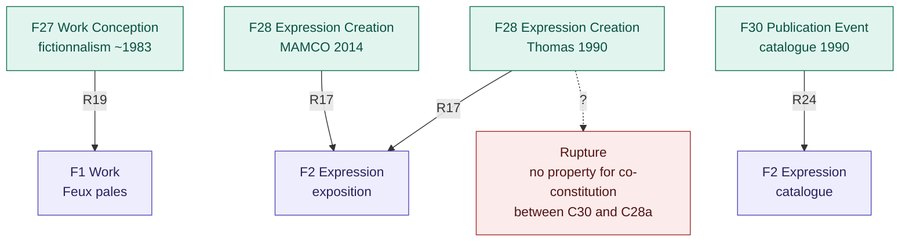

# Alternative A1 — Event-centred mapping

## Rationale

FRBRoo is fundamentally an event-based model built on CIDOC-CRM. Instead of starting from `F1_Work` as a stable entity, this alternative starts from acts of creation. The centre of gravity shifts: the exhibition is no longer an object that has manifestations, it is the result of a chain of intentional events. This reading is closer to conservation epistemology, where every observation is an attributed, dated act.

## Diagram

## What this resolves

- Foregrounds the intentional acts behind the exhibition rather than a static entity
- `F27_Work_Conception` allows modelling the fictionnalism project (~1983) as the conceptual origin of *Feux pâles*
- Two `F28_Expression_Creation` events for 1990 (Thomas) and 2014 (MAMCO) correctly distinguish the original act from the reactivation

## Rupture

`F30_Publication_Event` (catalogue) and `F28_Expression_Creation` (exposition) cannot be linked in FRBRoo to express their co-constitutive relationship. There is no property stating that C30 and C28a together produce a single unified work rather than two parallel expressions.
