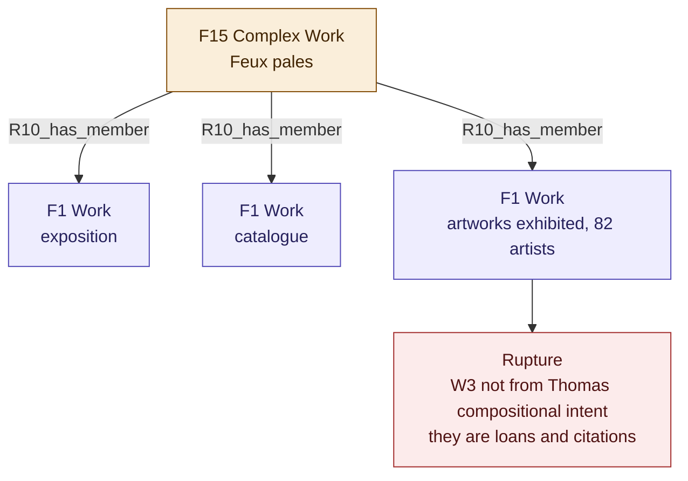
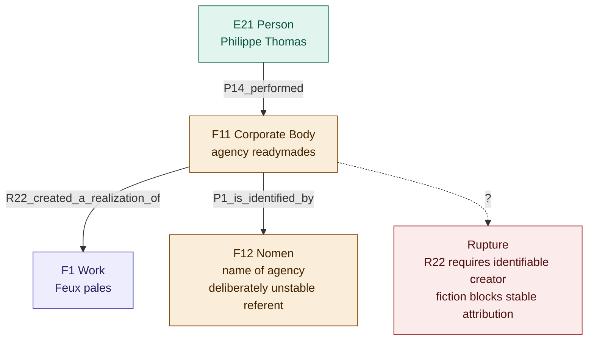
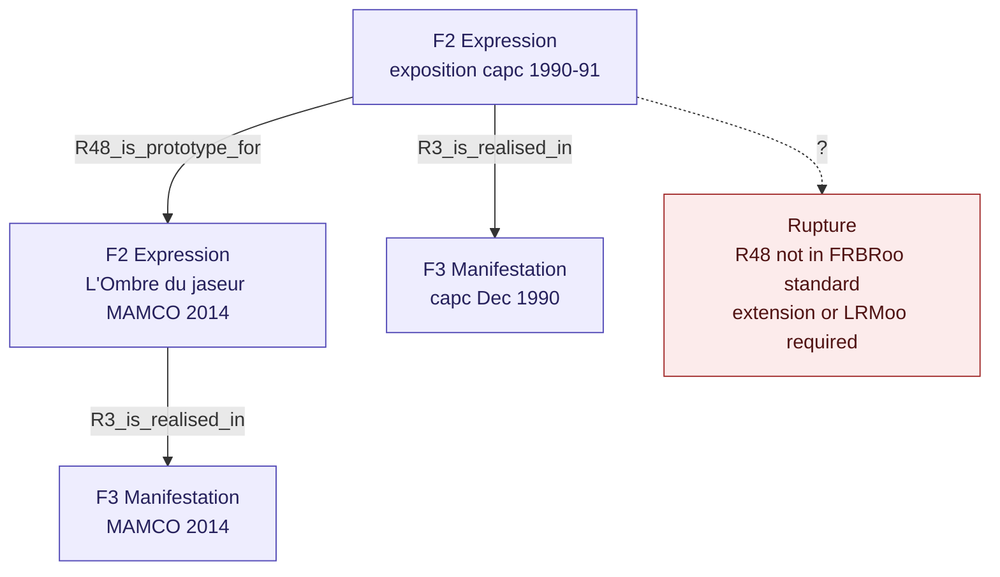

# Alternative A2 — F15_Complex_Work

## Rationale

`F15_Complex_Work` is designed for works composed of several distinct works forming a whole. Modelling *Feux pâles* as a `F15_Complex_Work` whose members are the exposition, the catalogue, and the 82 exhibited artworks partially resolves Rupture 1 (catalogue co-constitution) without forcing a derivation relationship.

## Diagram

## Rupture

`F15_Complex_Work` presupposes a unified compositional intent across all members. The 82 exhibited artworks are not components of *Feux pâles* in the sense that Thomas created them — they are loans, borrowings, citations. The agency's fiction precisely undermines the notion of unified authorial intent that `R10_has_member` implies.

---

# Alternative A3 — F12_Nomen for the agency

## Rationale

The agency © *readymades appartiennent à tout le monde*® is not a physical person, not a legal institution, and not a fictive character in the narrative sense. Using `F12_Nomen` to model the agency's name as a deliberately unstable appellation — whose referent changes depending on who consults it (naive visitor, informed insider, researcher) — is ontologically honest: it models the name rather than the entity.

## Diagram

## Rupture

`R22_created_a_realization_of` still requires a stable, identifiable creator. The fiction of authorship does not dissolve by modelling the name — the property itself presupposes what the artistic device deliberately withholds.

---

# Alternative A4 — R48_is_prototype_for

## Rationale

*L'Ombre du jaseur* (MAMCO, 2014) is not a new `F3_Manifestation` of the 1990 expression: it is a reinterpretation that takes the 1990 exhibition as prototype. `R48_is_prototype_for` allows distinguishing the capc→MAMCO relation (prototype) from the relation catalogue 1990→2nd printing (reproduction), a distinction the proposed mapping's four-expression structure cannot express.

## Diagram

## Rupture

`R48_is_prototype_for` is defined in LRMoo but not in FRBRoo standard. Using it requires either working explicitly within LRMoo (which is the object-oriented successor to FRBRoo) or declaring a local extension. This is not a fatal problem — it is an honest acknowledgement of the model's scope.
