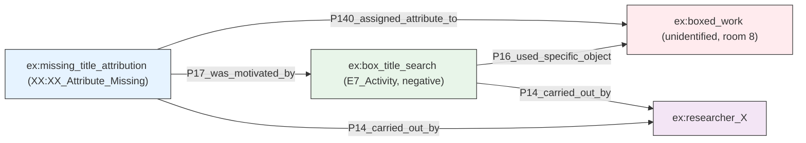
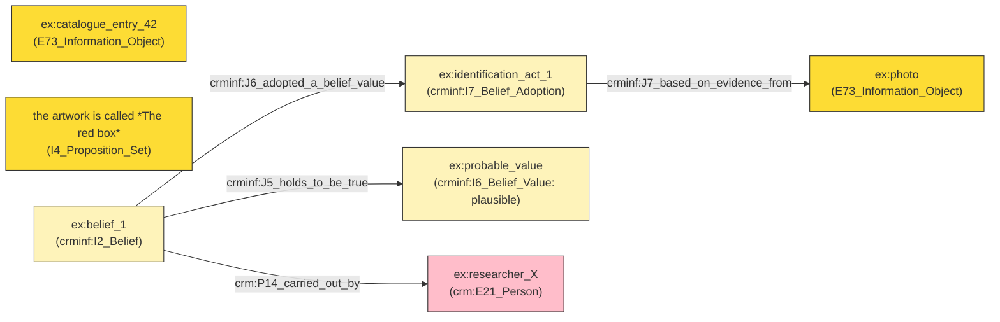
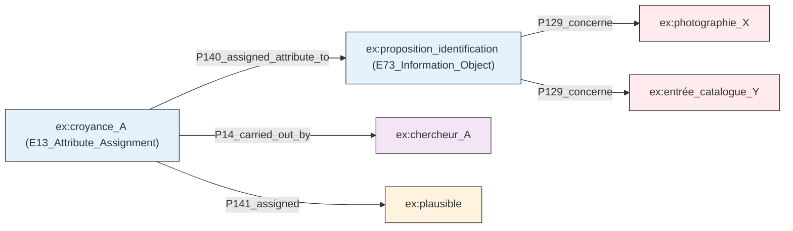
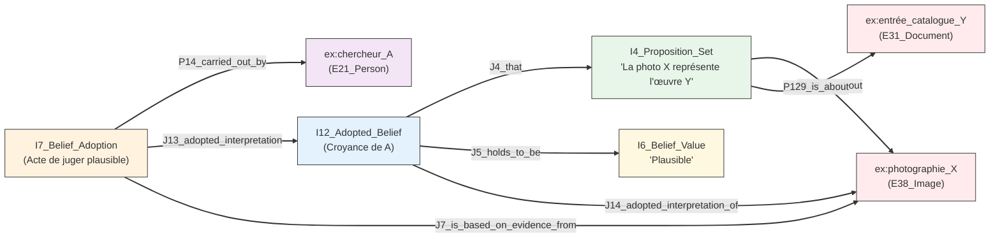
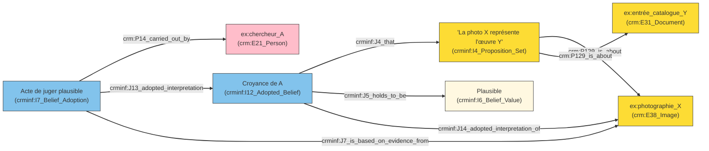
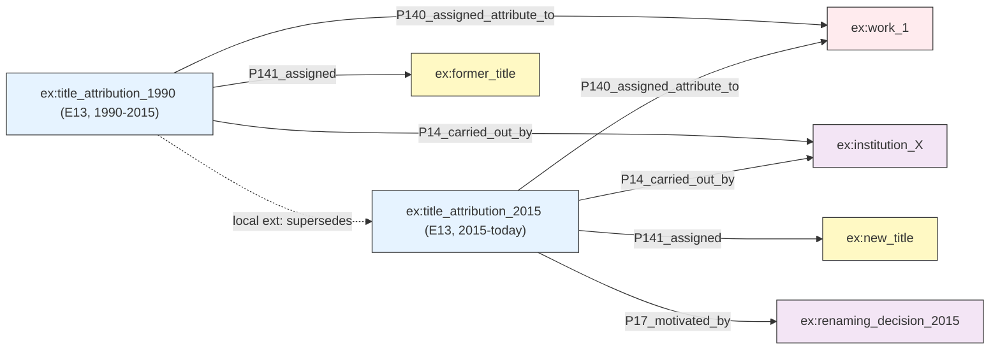

Flou et croyance : deux cas d’usage

1. L’incertitude qualitative (Croyance) « Je vois une œuvre sur une photographie et je pense qu'elle correspond à une entrée du catalogue, mais seulement de manière plausible, pas certaine. »

Dans ce scénario, l'information n'est ni vraie ni fausse, elle est plausible. Le CRM (CIDOC CRM) ne permet pas d'attacher des modificateurs de vérité directement aux propriétés. La solution réside dans la réification : on transforme la proposition en un objet à part entière (une instance de E73_Information_Object ou via une extension comme CRMinf) pour y attacher la croyance.

Cela permet à deux chercheurs d'entretenir des croyances contradictoires sur le même fait sans créer d'incohérence dans le graphe. La croyance devient un fait documenté : « Le chercheur A croit que l'identification est plausible ».

mermaid
graph LR
    classDef obj fill:#ffebee,stroke:#333;
    classDef belief fill:#e3f2fd,stroke:#333;
    classDef actor fill:#f3e5f5,stroke:#333;
    classDef value fill:#fff3e0,stroke:#333;

    photo["ex:photographie_X"]:::obj
    catalogue["ex:entrée_catalogue_Y"]:::obj
    identification["ex:proposition_identification (E73_Information_Object)"]:::belief
    chercheur["ex:chercheur_A"]:::actor
    qualif["ex:plausible"]:::value

    identification -->|P129_concerne| photo
    identification -->|P129_concerne| catalogue
    croyance["ex:croyance_A (E13_Attribute_Assignment)"]:::belief
    croyance -->|P14_carried_out_by| chercheur
    croyance -->|P140_assigned_attribute_to| identification
    croyance -->|P141_assigned| qualif

2. La lacune documentée (Absence) Si la croyance gère le « peut-être », comment gérer le « nous avons cherché et il n'y a rien » ?

Le CRM, fonctionnant selon une logique de monde ouvert, considère déjà l'absence d'assertion comme une absence de connaissance plutôt que comme une négation. C'est une bonne approche par défaut : si rien n'est dit, on ne sait pas. Cependant, cette passiveité pose problème dans la pratique muséale. Une absence de titre peut signifier deux choses très différentes :

    Personne n'a encore cherché le titre (ignorance simple).
    Une recherche approfondie a été menée et n'a rien donné (lacune documentée).

Pour distinguer ces deux états, il ne suffit pas de laisser la propriété vide. Il faut déclarer explicitement que l'absence est le résultat d'une investigation. C'est pourquoi je propose la création d'une classe dédiée, XX:XX_Attribute_Missing (sous-classe de E13_Attribute_Assignment), plutôt que d'utiliser une valeur de remplacement (comme "Inconnu" ou "N/A") pour chaque propriété.

En faisant de l'absence un objet à part entière, son statut devient directement interrogeable. On peut alors demander au graphe : « Quelles sont les œuvres dont l'absence de titre a été documentée ? » et obtenir une réponse précise, distinguant ces cas des simples oublis. Un seul artefact réel nécessite souvent plusieurs petits mécanismes de ce type simultanément, superposés sur différentes propriétés du même nœud (titre manquant documenté, auteur incertain, date plausible), permettant ainsi une modélisation fine de l'état des connaissances.

graph LR
    classDef obj fill:#ffebee,stroke:#333;
    classDef prop fill:#e8f5e9,stroke:#333;
    classDef belief fill:#e3f2fd,stroke:#333;
    classDef act fill:#fff3e0,stroke:#333;
    classDef actor fill:#f3e5f5,stroke:#333;
    classDef val fill:#fff8e1,stroke:#333;

    %% Objets réels (CRM de base)
    photo["ex:photographie_X<br/>(E38_Image)"]:::obj
    catalogue["ex:entrée_catalogue_Y<br/>(E31_Document)"]:::obj

    %% CRMinf v1.0 : La Proposition (I4)
    prop_node["I4_Proposition_Set<br/>'La photo X représente l'œuvre Y'"]:::prop
    
    %% CRMinf v1.0 : La Croyance Adoptée (I12)
    %% C'est une sous-classe de I2_Belief
    belief_node["I12_Adopted_Belief<br/>(Croyance de A)"]:::belief
    
    %% CRMinf v1.0 : La Valeur de Vérité (I6)
    val_node["I6_Belief_Value<br/>'Plausible'"]:::val

    %% CRMinf v1.0 : L'Acte d'adoption (I7)
    act_node["I7_Belief_Adoption<br/>(Acte de juger plausible)"]:::act
    chercheur["ex:chercheur_A<br/>(E21_Person)"]:::actor

    %% Relations STRICTES v1.0
    
    %% 1. La croyance adoptée porte sur un ensemble de propositions (J4 - hérité de I2)
    belief_node -->|J4_that| prop_node
    
    %% 2. La proposition concerne les objets réels (P129 is about Utilisée pour lier le I4_Proposition_Set aux entités réelles (Photo, Catalogue), car I4 est une sous-classe de E73_Information_Object qui peut utiliser P129.)
    prop_node -->|P129_is_about| photo
    prop_node -->|P129_is_about| catalogue

    %% 3. La croyance tient cette valeur pour vraie/fausse/plausible (J5)
    belief_node -->|J5_holds_to_be| val_node

    %% 4. L'acteur réalise l'acte d'adoption (P14_carried_out_by - hérité de E7 Activity)
    act_node -->|P14_carried_out_by| chercheur

    %% 5. L'acte conclut/adopte la croyance (J13 adopted interpretation)
    act_node -->|J13_adopted_interpretation| belief_node

    %% 6. L'acte est basé sur la preuve visuelle (J7 is based on evidence from)
    act_node -->|J7_is_based_on_evidence_from| photo

    %% 7. Optionnel : La croyance adoptée référence la source (J14)
    belief_node -->|J14_adopted_interpretation_of| photo

    linkStyle default stroke:#333,stroke-width:2px;

## Missing information (lacuna)

*An unidentified graphic work, contained in a box, appears in the display case of room 8, "Le musée réfléchi." No caption, no inventory number, no mention in the catalogue or the press file.*

J'ai un doute 

Utiliser Name: [I6 Belief Value](https://ontome.net/class/475/namespace/42)

Type: owl:Class

Comment: <p>This class comprises any encoding of the value of the truth of an I2 Belief. It may be expressed in terms of discrete logic, modal logic,  probability, fuzziness or other adequate representational  system.</p> <p>A minimum requirement of flexibility is for 3 values: True;  False; Unknown</p>

ou

```turtle
XX:XX_Attribute_Missing a owl:Class ;
    rdfs:subClassOf crm:E13_Attribute_Assignment ;
    rdfs:label "Attribute Missing"@en ;
    rdfs:comment "An attribute assignment that records the documented absence of a value for a property after a search activity."@en .
```





/** Notes **/

The second case is missing information, a lacuna, and I will go straight to a concrete instance from the corpus: an unidentified graphic work, in a box, visible in the display case of room 8, "Le musée réfléchi." Uncaptioned, absent from the catalogue and the press file.

CRM, working in an open-world logic, already treats absence of assertion as absence of knowledge rather than as negation, which is a good default. But the real problem is different: I want to declare explicitly that a search was undertaken and came back empty, so that the gap reads as documented rather than as a simple oversight. I created one new, named class, XX:XX_Attribute_Missing, subclassed from E13, rather than a per-property placeholder value. Because it is its own declared class, the title's status becomes directly queryable: I can ask the graph "which titles are documented lacunae" and get an answer. A single real artefact routinely needs several small mechanisms like this at once, layered on different properties of the same node.


*





*I see an artwork in a photograph and believe it matches a catalog entry, but only plausibly, not certainly.




Voici la section mise à jour, intégrant l'argumentaire crucial sur pourquoi la valeur `Unknown` de CRMinf ne suffit pas pour remplacer une classe de « lacune documentée ».

***

# Flou et croyance : deux cas d’usage

## 1. L’incertitude qualitative (Croyance)

**Cas d’usage :** *« Je vois une œuvre sur une photographie et je pense qu'elle correspond à une entrée du catalogue, mais seulement de manière plausible, pas certaine. »*

Dans ce scénario, l'information n'est ni vraie ni fausse ; elle est **plausible**. Le CIDOC CRM standard ne permet pas d'attacher des modificateurs de vérité directement aux propriétés. La solution réside dans la **réification** : on transforme la proposition en un objet à part entière pour y attacher la croyance et sa valeur de vérité.

Cela permet à deux chercheurs d'entretenir des croyances contradictoires sur le même fait sans créer d'incohérence dans le graphe. La croyance devient un fait documenté : « Le chercheur A croit que l'identification est plausible ».

### Approche A : Modélisation générique (CRM de base)
Cette approche utilise `E13_Attribute_Assignment` pour attacher une qualification à une proposition. Elle est simple mais moins sémantiquement riche concernant la logique de vérité.


### Approche B : Modélisation sémantique (CRMinf v1.0)
Pour une rigueur scientifique, l'extension **CRMinf (v1.0)** est préférable. Elle distingue clairement la **proposition** (`I4`), la **croyance** (`I2`/`I12`) et la **valeur de vérité** (`I6`). Ici, "Plausible" est une valeur de logique floue (`I6_Belief_Value`) et non un simple tag.



**Pourquoi CRMinf est supérieur ici ?**
Il permet d'interroger le graphe sur le *degré de vérité* des connaissances. On peut distinguer techniquement une hypothèse de travail (« Plausible ») d'un fait établi (« Vrai ») ou d'une erreur (« Faux »), tout en conservant l'historique de qui a émis cette croyance et sur quelle preuve.

---

## 2. La lacune documentée (Absence)

Si la croyance gère le « peut-être », comment gérer le « nous avons cherché et il n'y a rien » ?

Le CRM, fonctionnant selon une logique de **monde ouvert**, considère par défaut l'absence d'assertion comme une absence de connaissance (on ne sait pas) plutôt que comme une négation (c'est faux). C'est une bonne approche par défaut, mais elle pose problème dans la pratique muséale où il faut distinguer deux états très différents :
1.  **Ignorance simple :** Personne n'a encore cherché le titre.
2.  **Lacune documentée :** Une recherche approfondie a été menée et n'a rien donné.

### Pourquoi ne pas utiliser `I6_Belief_Value: Unknown` ?

On pourrait être tenté d'utiliser la valeur standard **`Unknown`** de la classe `I6_Belief_Value` dans CRMinf pour signaler cette absence. Cependant, cette approche est sémantiquement incorrecte pour deux raisons majeures :

1.  **Confusion entre état de connaissance et acte de recherche :**
    La valeur `Unknown` dans `I6` décrit l'état épistémique d'une croyance (*« Je crois que la valeur de vérité est inconnue »*). Elle ne documente pas l'**action** de recherche. Dire « C'est inconnu » est passif ; cela ne prouve pas que quelqu'un a activement tenté de trouver l'information. Une lacune documentée doit prouver l'effort infructueux, pas seulement constater l'ignorance.

2.  **Impossibilité de distinguer l'oubli de la recherche négative :**
    Si un catalogueur laisse un champ vide (logique du monde ouvert) ou assigne une croyance « Unknown » sans contexte, un requêteur ne peut pas savoir si :
    *   Le champ a été ignoré par négligence.
    *   Une recherche exhaustive a été faite dans les archives sans résultat.
    
    Or, pour un historien, cette distinction est capitale. Une « absence documentée » est une donnée positive qui ferme certaines pistes de recherche futures, tandis qu'une simple ignorance laisse le champ ouvert.

### La solution : Une classe d'acte dédiée

Pour résoudre ce problème, il faut modéliser l'acte de recherche lui-même, et non seulement son résultat. Je propose la création d'une classe dédiée, **`XX:XX_Attribute_Missing`** (sous-classe de `E13_Attribute_Assignment`), qui représente l'acte d'assigner l'absence comme attribut.

Contrairement à `I6_Unknown` qui est une *valeur*, cette classe est un *événement* (une activité). Elle permet de lier :
*   L'objet concerné (l'œuvre sans titre).
*   L'acteur qui a cherché (le chercheur).
*   La preuve de la recherche (les catalogues consultés et rejetés).
*   Le résultat nul (l'absence confirmée).

En faisant de l'absence un objet-acte à part entière, son statut devient directement interrogeable. On peut alors demander au graphe : *« Quelles sont les œuvres dont l'absence de titre a été activement documentée par un chercheur ? »* et obtenir une réponse précise, distinguant ces cas des simples oublis ou des champs non renseignés.

Un seul artefact réel nécessite souvent plusieurs petits mécanismes de ce type simultanément, superposés sur différentes propriétés du même nœud (titre manquant documenté via `XX:XX`, auteur incertain via `I6_Plausible`, date établie via `I6_True`), permettant ainsi une modélisation fine, honnête et actionnable de l'état des connaissances.


## Superseded or contradicted information

*A title, once accepted, is today judged offensive and has been formally replaced, but the historical fact must be kept.*



/** Notes **/

The underlying mechanism is the same one used for belief. Each successive attribution is a distinct E13 Attribute Assignment, dated through a time-span, carried out by a named actor. Nothing is overwritten, everything accumulates. The 1990 attribution stays in the graph, carrying its own time-span. The 2015 attribution sits alongside it, motivated by a documented renaming decision.

What CRM lacks natively is an explicit "supersedes" link, shown here as the dashed edge, clearly marked as a local, non-standard extension. Without it, the two attributions are only connected through the object they share, which says no more than "two attributions exist for this object." The edge makes explicit that this is not two researchers disagreeing, it is one institution formally replacing a title with another. That distinction is what lets the graph answer "which attribution currently holds" and "what was superseded, and by what," directly, rather than by inference from the time-spans alone.

ou belief ??