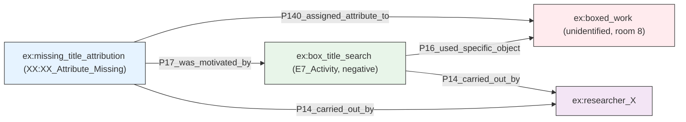
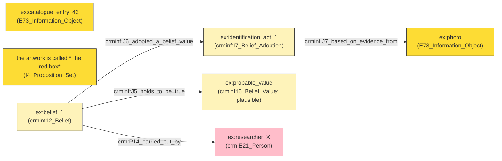
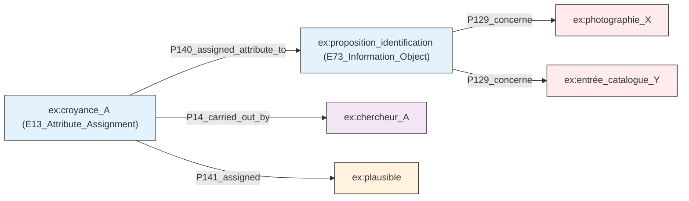
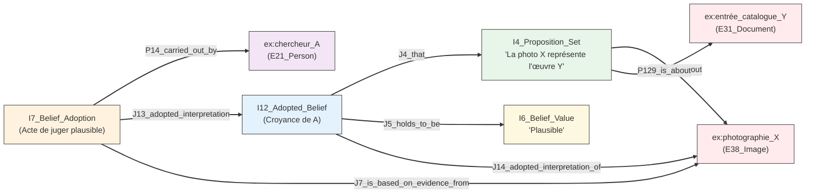
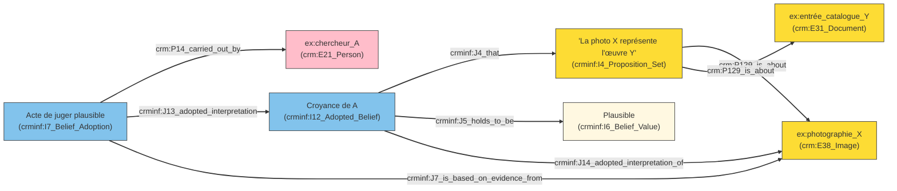
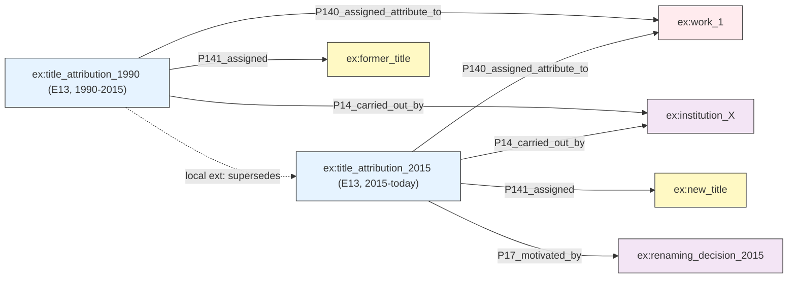
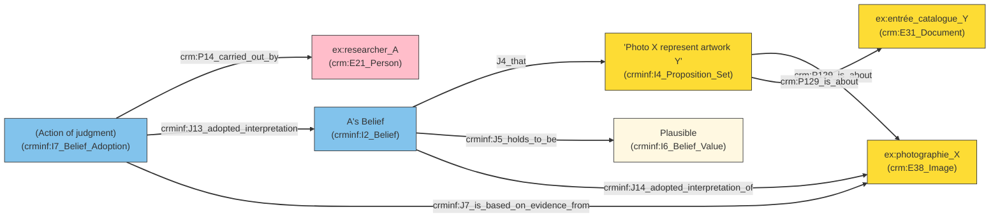

Flou et croyance : deux cas d’usage

1. L’incertitude qualitative (Croyance) « Je vois une œuvre sur une photographie et je pense qu'elle correspond à une entrée du catalogue, mais seulement de manière plausible, pas certaine. »

Dans ce scénario, l'information n'est ni vraie ni fausse, elle est plausible. Le CRM (CIDOC CRM) ne permet pas d'attacher des modificateurs de vérité directement aux propriétés. La solution réside dans la réification : on transforme la proposition en un objet à part entière (une instance de E73_Information_Object ou via une extension comme CRMinf) pour y attacher la croyance.

Cela permet à deux chercheurs d'entretenir des croyances contradictoires sur le même fait sans créer d'incohérence dans le graphe. La croyance devient un fait documenté : « Le chercheur A croit que l'identification est plausible ».

mermaid
graph LR
    classDef obj fill:#ffebee,stroke:#333;
    classDef belief fill:#e3f2fd,stroke:#333;
    classDef actor fill:#f3e5f5,stroke:#333;
    classDef value fill:#fff3e0,stroke:#333;

    photo["ex:photographie_X"]:::obj
    catalogue["ex:entrée_catalogue_Y"]:::obj
    identification["ex:proposition_identification (E73_Information_Object)"]:::belief
    chercheur["ex:chercheur_A"]:::actor
    qualif["ex:plausible"]:::value

    identification -->|P129_concerne| photo
    identification -->|P129_concerne| catalogue
    croyance["ex:croyance_A (E13_Attribute_Assignment)"]:::belief
    croyance -->|P14_carried_out_by| chercheur
    croyance -->|P140_assigned_attribute_to| identification
    croyance -->|P141_assigned| qualif

2. La lacune documentée (Absence) Si la croyance gère le « peut-être », comment gérer le « nous avons cherché et il n'y a rien » ?

Le CRM, fonctionnant selon une logique de monde ouvert, considère déjà l'absence d'assertion comme une absence de connaissance plutôt que comme une négation. C'est une bonne approche par défaut : si rien n'est dit, on ne sait pas. Cependant, cette passiveité pose problème dans la pratique muséale. Une absence de titre peut signifier deux choses très différentes :

    Personne n'a encore cherché le titre (ignorance simple).
    Une recherche approfondie a été menée et n'a rien donné (lacune documentée).

Pour distinguer ces deux états, il ne suffit pas de laisser la propriété vide. Il faut déclarer explicitement que l'absence est le résultat d'une investigation. C'est pourquoi je propose la création d'une classe dédiée, XX:XX_Attribute_Missing (sous-classe de E13_Attribute_Assignment), plutôt que d'utiliser une valeur de remplacement (comme "Inconnu" ou "N/A") pour chaque propriété.

En faisant de l'absence un objet à part entière, son statut devient directement interrogeable. On peut alors demander au graphe : « Quelles sont les œuvres dont l'absence de titre a été documentée ? » et obtenir une réponse précise, distinguant ces cas des simples oublis. Un seul artefact réel nécessite souvent plusieurs petits mécanismes de ce type simultanément, superposés sur différentes propriétés du même nœud (titre manquant documenté, auteur incertain, date plausible), permettant ainsi une modélisation fine de l'état des connaissances.

graph LR
    classDef obj fill:#ffebee,stroke:#333;
    classDef prop fill:#e8f5e9,stroke:#333;
    classDef belief fill:#e3f2fd,stroke:#333;
    classDef act fill:#fff3e0,stroke:#333;
    classDef actor fill:#f3e5f5,stroke:#333;
    classDef val fill:#fff8e1,stroke:#333;

    %% Objets réels (CRM de base)
    photo["ex:photographie_X<br/>(E38_Image)"]:::obj
    catalogue["ex:entrée_catalogue_Y<br/>(E31_Document)"]:::obj

    %% CRMinf v1.0 : La Proposition (I4)
    prop_node["I4_Proposition_Set<br/>'La photo X représente l'œuvre Y'"]:::prop
    
    %% CRMinf v1.0 : La Croyance Adoptée (I12)
    %% C'est une sous-classe de I2_Belief
    belief_node["I12_Adopted_Belief<br/>(Croyance de A)"]:::belief
    
    %% CRMinf v1.0 : La Valeur de Vérité (I6)
    val_node["I6_Belief_Value<br/>'Plausible'"]:::val

    %% CRMinf v1.0 : L'Acte d'adoption (I7)
    act_node["I7_Belief_Adoption<br/>(Acte de juger plausible)"]:::act
    chercheur["ex:chercheur_A<br/>(E21_Person)"]:::actor

    %% Relations STRICTES v1.0
    
    %% 1. La croyance adoptée porte sur un ensemble de propositions (J4 - hérité de I2)
    belief_node -->|J4_that| prop_node
    
    %% 2. La proposition concerne les objets réels (P129 is about Utilisée pour lier le I4_Proposition_Set aux entités réelles (Photo, Catalogue), car I4 est une sous-classe de E73_Information_Object qui peut utiliser P129.)
    prop_node -->|P129_is_about| photo
    prop_node -->|P129_is_about| catalogue

    %% 3. La croyance tient cette valeur pour vraie/fausse/plausible (J5)
    belief_node -->|J5_holds_to_be| val_node

    %% 4. L'acteur réalise l'acte d'adoption (P14_carried_out_by - hérité de E7 Activity)
    act_node -->|P14_carried_out_by| chercheur

    %% 5. L'acte conclut/adopte la croyance (J13 adopted interpretation)
    act_node -->|J13_adopted_interpretation| belief_node

    %% 6. L'acte est basé sur la preuve visuelle (J7 is based on evidence from)
    act_node -->|J7_is_based_on_evidence_from| photo

    %% 7. Optionnel : La croyance adoptée référence la source (J14)
    belief_node -->|J14_adopted_interpretation_of| photo

    linkStyle default stroke:#333,stroke-width:2px;

## Missing information (lacuna)

*An unidentified graphic work, contained in a box, appears in the display case of room 8, "Le musée réfléchi." No caption, no inventory number, no mention in the catalogue or the press file.*

J'ai un doute 

Utiliser Name: [I6 Belief Value](https://ontome.net/class/475/namespace/42)

Type: owl:Class

Comment: This class comprises any encoding of the value of the truth of an I2 Belief. It may be expressed in terms of discrete logic, modal logic,  probability, fuzziness or other adequate representational  system.</p> <p>A minimum requirement of flexibility is for 3 values: True;  False; Unknown

ou

```turtle
XX:XX_Attribute_Missing a owl:Class ;
    rdfs:subClassOf crm:E13_Attribute_Assignment ;
    rdfs:label "Attribute Missing"@en ;
    rdfs:comment "An attribute assignment that records the documented absence of a value for a property after a search activity."@en .
```





/** Notes **/

The second case is missing information, a lacuna, and I will go straight to a concrete instance from the corpus: an unidentified graphic work, in a box, visible in the display case of room 8, "Le musée réfléchi." Uncaptioned, absent from the catalogue and the press file.

CRM, working in an open-world logic, already treats absence of assertion as absence of knowledge rather than as negation, which is a good default. But the real problem is different: I want to declare explicitly that a search was undertaken and came back empty, so that the gap reads as documented rather than as a simple oversight. I created one new, named class, XX:XX_Attribute_Missing, subclassed from E13, rather than a per-property placeholder value. Because it is its own declared class, the title's status becomes directly queryable: I can ask the graph "which titles are documented lacunae" and get an answer. A single real artefact routinely needs several small mechanisms like this at once, layered on different properties of the same node.


*





*I see an artwork in a photograph and believe it matches a catalog entry, but only plausibly, not certainly.




Voici la section mise à jour, intégrant l'argumentaire crucial sur pourquoi la valeur `Unknown` de CRMinf ne suffit pas pour remplacer une classe de « lacune documentée ».

***

# Flou et croyance : deux cas d’usage

## 1. L’incertitude qualitative (Croyance)

**Cas d’usage :** *« Je vois une œuvre sur une photographie et je pense qu'elle correspond à une entrée du catalogue, mais seulement de manière plausible, pas certaine. »*

Dans ce scénario, l'information n'est ni vraie ni fausse ; elle est **plausible**. Le CIDOC CRM standard ne permet pas d'attacher des modificateurs de vérité directement aux propriétés. La solution réside dans la **réification** : on transforme la proposition en un objet à part entière pour y attacher la croyance et sa valeur de vérité.

Cela permet à deux chercheurs d'entretenir des croyances contradictoires sur le même fait sans créer d'incohérence dans le graphe. La croyance devient un fait documenté : « Le chercheur A croit que l'identification est plausible ».

### Approche A : Modélisation générique (CRM de base)
Cette approche utilise `E13_Attribute_Assignment` pour attacher une qualification à une proposition. Elle est simple mais moins sémantiquement riche concernant la logique de vérité.


### Approche B : Modélisation sémantique (CRMinf v1.0)
Pour une rigueur scientifique, l'extension **CRMinf (v1.0)** est préférable. Elle distingue clairement la **proposition** (`I4`), la **croyance** (`I2`/`I12`) et la **valeur de vérité** (`I6`). Ici, "Plausible" est une valeur de logique floue (`I6_Belief_Value`) et non un simple tag.



**Pourquoi CRMinf est supérieur ici ?**
Il permet d'interroger le graphe sur le *degré de vérité* des connaissances. On peut distinguer techniquement une hypothèse de travail (« Plausible ») d'un fait établi (« Vrai ») ou d'une erreur (« Faux »), tout en conservant l'historique de qui a émis cette croyance et sur quelle preuve.

---

## 2. La lacune documentée (Absence)

Si la croyance gère le « peut-être », comment gérer le « nous avons cherché et il n'y a rien » ?

Le CRM, fonctionnant selon une logique de **monde ouvert**, considère par défaut l'absence d'assertion comme une absence de connaissance (on ne sait pas) plutôt que comme une négation (c'est faux). C'est une bonne approche par défaut, mais elle pose problème dans la pratique muséale où il faut distinguer deux états très différents :
1.  **Ignorance simple :** Personne n'a encore cherché le titre.
2.  **Lacune documentée :** Une recherche approfondie a été menée et n'a rien donné.

### Pourquoi ne pas utiliser `I6_Belief_Value: Unknown` ?

On pourrait être tenté d'utiliser la valeur standard **`Unknown`** de la classe `I6_Belief_Value` dans CRMinf pour signaler cette absence. Cependant, cette approche est sémantiquement incorrecte pour deux raisons majeures :

1.  **Confusion entre état de connaissance et acte de recherche :**
    La valeur `Unknown` dans `I6` décrit l'état épistémique d'une croyance (*« Je crois que la valeur de vérité est inconnue »*). Elle ne documente pas l'**action** de recherche. Dire « C'est inconnu » est passif ; cela ne prouve pas que quelqu'un a activement tenté de trouver l'information. Une lacune documentée doit prouver l'effort infructueux, pas seulement constater l'ignorance.

2.  **Impossibilité de distinguer l'oubli de la recherche négative :**
    Si un catalogueur laisse un champ vide (logique du monde ouvert) ou assigne une croyance « Unknown » sans contexte, un requêteur ne peut pas savoir si :
    *   Le champ a été ignoré par négligence.
    *   Une recherche exhaustive a été faite dans les archives sans résultat.
    
    Or, pour un historien, cette distinction est capitale. Une « absence documentée » est une donnée positive qui ferme certaines pistes de recherche futures, tandis qu'une simple ignorance laisse le champ ouvert.

### La solution : Une classe d'acte dédiée

Pour résoudre ce problème, il faut modéliser l'acte de recherche lui-même, et non seulement son résultat. Je propose la création d'une classe dédiée, **`XX:XX_Attribute_Missing`** (sous-classe de `E13_Attribute_Assignment`), qui représente l'acte d'assigner l'absence comme attribut.

Contrairement à `I6_Unknown` qui est une *valeur*, cette classe est un *événement* (une activité). Elle permet de lier :
*   L'objet concerné (l'œuvre sans titre).
*   L'acteur qui a cherché (le chercheur).
*   La preuve de la recherche (les catalogues consultés et rejetés).
*   Le résultat nul (l'absence confirmée).

En faisant de l'absence un objet-acte à part entière, son statut devient directement interrogeable. On peut alors demander au graphe : *« Quelles sont les œuvres dont l'absence de titre a été activement documentée par un chercheur ? »* et obtenir une réponse précise, distinguant ces cas des simples oublis ou des champs non renseignés.

Un seul artefact réel nécessite souvent plusieurs petits mécanismes de ce type simultanément, superposés sur différentes propriétés du même nœud (titre manquant documenté via `XX:XX`, auteur incertain via `I6_Plausible`, date établie via `I6_True`), permettant ainsi une modélisation fine, honnête et actionnable de l'état des connaissances.


## Superseded or contradicted information

*A title, once accepted, is today judged offensive and has been formally replaced, but the historical fact must be kept.*



/** Notes **/

The underlying mechanism is the same one used for belief. Each successive attribution is a distinct E13 Attribute Assignment, dated through a time-span, carried out by a named actor. Nothing is overwritten, everything accumulates. The 1990 attribution stays in the graph, carrying its own time-span. The 2015 attribution sits alongside it, motivated by a documented renaming decision.

What CRM lacks natively is an explicit "supersedes" link, shown here as the dashed edge, clearly marked as a local, non-standard extension. Without it, the two attributions are only connected through the object they share, which says no more than "two attributions exist for this object." The edge makes explicit that this is not two researchers disagreeing, it is one institution formally replacing a title with another. That distinction is what lets the graph answer "which attribution currently holds" and "what was superseded, and by what," directly, rather than by inference from the time-spans alone.

ou belief ??


Ma proposition : 

## 3. How can a documentary model accommodate **epistemic status**?

<figure>

<figcaption>Couleur code in Conservation Report. Figure : Zoë Renaudie</figcaption>
</figure>

- Black = verified
- Grey = missing
- Blue = uncertain
- Strikethrough = historically valid, now obsolete

/** Notes **/

The starting point of this question is the color-coded table I made in 2017 to show in plain text, in the table what were the epistemic class of the data: black for "verified," blue for "uncertain," gray for "missing," struck through for "historically obsolete." That visual table serves as an anchor, but the goal is to turn these colors into queryable patterns in a knowledge graph.

===vvvvvv===

## Assertion 

<figure>

<figcaption>meta-presentation of the metadata schema(s) Schema : Anais Guilhem</figcaption>
</figure>


/** Notes **/

Cidoc Crm rely on `E13 Attribute Assignment`. An attribute is never simply attached to an object; it is assigned during a specific event, by a named actor, at a dated moment, for a stated reason. That event itself becomes an entity in the graph, one that can be cited, contested, or replaced. E13 alone documents that a value was asserted. It says nothing about how confident we are in that value, or about what happens when two actors disagree not on the classification but on the fact itself. For that we need to use CRMinf. 

===vvvvvv===

## Fuzziness and belief

*I see an object (`crm:Human-made_Object`, a cup) in an exhibition photograph, and I believe it corresponds to an entry in the catalogu ("antique cup"), but only plausibly, not with certainty.*

<figure>


<figcaption>@prefix crm:     <"http://www.cidoc-crm.org/cidoc-crm/">   </figcaption>
<figcaption>@prefix crminf: <"http://www.ics.forth.gr/isl/CRMinf/">  </figcaption>
</figure>

/** Notes **/

*I see an object (`crm:Human-made_Object`, a cup) in an exhibition photograph, and I believe it corresponds to a catalogue entry ("antique cup"), but only plausibly, not with certainty.*

E13 can record that I asserted this identification. It cannot record how sure I am, or let a second researcher hold a different degree of certainty without contradicting the first. Standard CIDOC-CRM does not allow a truth modifier ("maybe") to be attached directly to a property. CRMinf's solution is a second reification, on top of the first: turning the proposition into a first-class object, so that belief and its truth-value can be attached to it. Two researchers can then hold contradictory beliefs about the same fact without creating any inconsistency in the graph; the belief itself becomes a documented fact: "Researcher A believes the identification is plausible."

CRMinf distinguishes the proposition (I4), the belief (I2/I12), and the truth value (I6). Here, "plausible" is a fuzzy-logic value, `I6_Belief_Value`. 

===vvvvvv===

### Lacunae and Opacity

### 

| State    | What happened                     | Class                           |
| -------- | --------------------------------- | ------------------------------- |
| Verified | a value was sought, and asserted  | `E13_Attribute_Assignment`      |
| Lacuna   | a value was sought, and not found | `Negative_Attribute_Assignment` |
| Opacity  | a value is known, and withheld    | `Withheld_Attribute_Assignment` |

/** Notes **/

Fuzzy belief addresses part of the problem: it documents what we know poorly. Two cases remain that CRMinf does not cover, and neither is a matter of degree of belief, so the fix is not another CRMinf extension but a return to E13 itself, with two new subclasses:

- what we failed to find out,
- what we are not allowed to say.

===vvvvvv===

### Lacunae

```turtle
ex:Negative_Attribute_Assignment a owl:Class ;
    rdfs:subClassOf crm:E13_Attribute_Assignment ;
    rdfs:label "Negative Attribute Assignment"@en,
               "Assignation d'attribut négative"@fr ;
    rdfs:comment "Records a search having been carried out for the value of a property, and having found none." .
```
/** Notes **/

The first case is familiar to anyone who has done museum documentation work: hours of research, and nothing. In *Feux pâles*, this is an object visible in an exhibition photograph, never identified. Documenting that as a simple empty field loses something essential: the cell is not empty out of negligence, it is empty as a documented finding. The CIDOC-CRM SIG has itself been working on this distinction since 2019, and Velios, Meghini, Doerr, and Stead proposed, in 2023, a formal extension, **negative typed properties**, to document this kind of confirmed absence. 
My solution, not a property but a class `Negative_Attribute_Assignment` takes the event-based route instead.


LACUNE : autre approche 

# A Specification for Provenance Records with Declared Absence

**Version 0.6**
**Date:** 2026-09-14
**Author:** Christopher Banks, Objects of Affection Collection
**DOI:** 10.5281/zenodo.22063353 (all versions) · 10.5281/zenodo.22063354 (v0.1, 2026-08-22) · 10.5281/zenodo.22084159 (v0.2, 2026-08-24) · 10.5281/zenodo.22150280 (v0.3, 2026-08-28) · 10.5281/zenodo.22234788 (v0.4, 2026-09-01) · 10.5281/zenodo.22303877 (v0.5, 2026-09-04) · 10.5281/zenodo.22751179 (v0.6, 2026-09-14)

**Changes in 0.6.** Section 5 gains **5.6** and **THIS IS A NORMATIVE CHANGE.** A gap declared `not_yet_obtained` **MUST** carry `absence_review_by`, a date or NULL and never a condition, on the same rule section 6.1 applies to a withholding; section 10 gains **requirement 14**; **requirement 16's no-variation range moves to 1 through 14 in the same edit, and the SHOULD and the range renumber to 15 and 16.** A second, optional field, `absence_enquired_on`, records that the named holder was asked and when, so that a holder who does not answer is distinguishable from a holder who was never asked. The change closes a defect found by the author on 2026-09-14 while comparing this specification against the Getty Provenance Index's documentation act and the ICOM-CIDOC Statement of Principles of Museum Documentation (2012): section 5.5 required work to have an addressee and never required it to have a date, so a gap could be correctly typed as work and stay open forever with nothing to show that it had. The Principles' own requirement 14 already asks for a documentation upgrade "by an agreed deadline" at the level of a collection; this version asks it at the level of the gap. **Non-normative in the same version:** section 11 credits the Principles where prior art is discussed, and section 13 declares two further gaps rather than closing them. **No requirement changes as a result of either.**

**Changes in 0.5.** Section 6 is amended and **THIS IS A NORMATIVE CHANGE.** `field_disclosure` gains an optional `withheld_until` date, and section 10 gains **requirement 13**, which requires a known end date on a withholding to be recorded where one exists; **requirement 14's no-variation range moves to 1 through 13 in the same edit, and the SHOULD and the range renumber to 14 and 15.** The change corrects a sentence in section 6 that was true of the case it was written from and false in general: withholding was described as something *"nobody can ever close, by design."* It answers a case put to the author on 2026-09-04 by an archivist at a major auction house, **who is not named here because he has not been asked.** The pattern is adopted from ISAD(G) element 4.1 and is not claimed as novel. **Non-normative in the same version:** section 11 credits ISAD(G) where prior art is discussed, section 13 declares two further gaps rather than closing them, and three em-dashes inherited from earlier versions are replaced under the house style rule. **No requirement changes as a result of any of those.**

**Changes in 0.4.** Section 5.4 is added: an absence entry describes the record rather than the world, and an external source that fills a declared gap supersedes the entry rather than conflicting with it. **THIS IS A NORMATIVE CHANGE**, adding two MUST NOT clauses. It answers an open world objection put to the author on 2026-08-28 by a standards practitioner in cultural heritage informatics, **who is not named here because he has not been asked.** Section 10 gains **requirement 12**, which requires a conforming record to declare the specification it conforms to, its version and its persistent identifier; **requirement 14's no-variation range moves to 1 through 12 in the same edit.**
**Changes in 0.3.** Section 11 is expanded. CRMinf, Huggett (2020) and the archival science literature on silence are added alongside Linked Art, CIDOC CRM and Art Tracks, each quoted where it states its own position, and the pattern across them is named. **No normative change.** The contribution claimed in section 11 is unchanged and remains narrow.
**Changes in 0.2.** Section 9 now requires a conforming implementation to publish the method by which its hashes are computed, and points at the normalization rules and reference implementation published as doi:10.5281/zenodo.22083313. Section 13 records that gap as resolved rather than removing it. No other normative change.
**Cite as:** Banks, C. (2026). Lacuna: A Specification for Provenance Records with Declared Absence. Zenodo.
**License:** CC BY 4.0
**Status:** Enabling disclosure. First published 2026-08-22; this version published 2026-09-04. Published to establish prior art. Not a standard until implemented by someone other than its author.

> **THE NAME IN USE IS LACUNA, AND THIS DOCUMENT IS DEPOSITED UNDER IT.** Whether it is the
> permanent name of the standard is not settled. The subtitle is descriptive. The
> standard's name is a branding and trademark decision belonging to the author, and it is not
> settled here.

---

## Abstract

This document specifies a structure for recording the custody of an object over time.

Its distinguishing feature is that **absence is a first class, typed, reasoned entry rather than a
missing value.** Where a conventional record leaves a field blank, a conforming record states which
kind of absence this is and why, as a row with the same standing as any other. A record with
declared gaps is more trustworthy than one that appears complete, because the second kind cannot be
distinguished from one that was never checked.

A second feature follows from a real maker's refusal during the first week of field testing: **a
withheld fact is not an absent one.** Withholding is recorded separately from absence, and a
withheld field must name who withheld it.

**This specification does not authenticate anything.** See section 1.2.

---

## 1. Scope

### 1.1 What a record is

A provenance record is **a sequence of dated assertions about who held an object, when, and on what
basis.** It is about custody across time. Each assertion carries its own source.

### 1.2 What a record is not, stated first because it is the most common error

**A provenance record makes no claim that an object is genuine.** Authentication is a judgment about
an object at a moment. Provenance is a record of custody over time. They are different acts, they
fail differently, and conflating them is the defect this specification exists to avoid.

A conforming implementation **MUST NOT** describe its output as proof of authenticity, and **MUST
NOT** present an integrity guarantee (section 9) as one.

A certificate of authenticity issued by a third party **MAY** be recorded as an input to a record,
qualified as attested (section 8). It is evidence that someone made a claim. It is not the claim of
this record.

### 1.3 Domain independence

The structure is fixed. **The vocabulary is not.**

A conforming record uses the terms the maker actually uses. A label that produces "waves" records
waves, not editions. A grower records a harvest. **Translating a maker's own vocabulary into a
generic one is a small act of erasure and a conforming implementation SHOULD avoid it.**

What may never vary: the required fields, what counts as a source, what an absence looks like, and
what a subject may assert about their own object. Those are fixed before any party adopts the
specification, including its author.

---

## 2. Conformance language

**MUST**, **MUST NOT**, **SHOULD**, **MAY** carry their ordinary specification meanings. A
conforming implementation satisfies every MUST.

---

## 3. Parties

A **party** is a person, organization, group, or an explicitly unidentified actor.

```
parties(id, kind, display_name, created_at)
  kind ∈ { person, organization, group, unidentified }
  display_name is non-empty
```

**`unidentified` is a party, not a null.** "Sold to a private collector whose name was not recorded"
is a real event with a real actor, and modeling it as a missing party loses the event. A record
**MUST** represent an unnamed holder as an `unidentified` party rather than omitting the custody
event.

Relations between parties (succession, control, corporate identity over time) are recorded
separately, each with its own effective date and source, because **institutions rename, merge, and
dissolve, and a record spanning decades must survive that.**

---

## 4. Custody events

The spine of a record.

```
custody_events(id, object_id, kind, began_on, ended_on, quantity, unit,
               parent_event_id, method, absence_state, absence_reason,
               absence_holder, absence_asserted_at, absence_review_by,
               absence_enquired_on, created_at)
  kind ∈ { origin, held, transfer, gap }
```

**`absence_holder` and `absence_asserted_at` are populated only on `gap` rows**, and section 5.5
states when each is mandatory. **`absence_asserted_at` is not `created_at`.** `created_at` records
when the row appeared and never changes. `absence_asserted_at` records **when the absence was last
affirmed**, and moves when a custodian re-checks an open gap and finds it still open. **A record
that cannot distinguish those two is unable to say whether a ten-year-old gap was ever looked at
twice.** `absence_review_by` and `absence_enquired_on` are populated only on `not_yet_obtained`
rows; section 5.6 states when each is mandatory.

| kind | meaning |
|---|---|
| `origin` | the object came into existence |
| `held` | a party had custody across a span |
| `transfer` | custody moved |
| `gap` | **a declared absence in the chain.** See section 5. |

**`origin` exists to protect `gap`.** Without an explicit origin, "nothing came before this" would
have to be expressed as a gap, and the record would carry a permanent false absence at the start of
every chain. A conforming implementation **MUST** enforce that an `origin` event has no parent.

`quantity` and `unit` are required because **not every object is indivisible.** A harvest divides. A
bolt of cloth is cut. Quantity **MUST** be positive; a zero quantity is not a custody event.

---

## 5. Absence is a typed, reasoned entry

**The central requirement of this specification.**

A gap in a chain of custody is **not** a null, a blank field, or a flag. It is a row, of the same
kind as every other row, and it **MUST** state which kind of absence it is and why.

### 5.1 The absence vocabulary

```
absence_state ∈ { unknowable, not_applicable, not_yet_obtained, never_required }
```

| state | meaning | what a reader should do |
|---|---|---|
| `unknowable` | the fact cannot be recovered by anyone | stop looking |
| `not_applicable` | the question does not arise for this object | stop asking |
| `not_yet_obtained` | the fact exists and has not been collected | **this is work, and it can be closed** |
| `never_required` | the question is not proper to ask here | do not ask |

**The completeness test for this vocabulary is that each state licenses a different action.** A
vocabulary whose members produce identical behavior is one state wearing four names.

### 5.2 The load bearing constraints

A conforming implementation **MUST** enforce all of the following:

```
(kind = 'gap') = (absence_state IS NOT NULL)     -- gaps and only gaps carry a state
kind <> 'gap' OR length(btrim(absence_reason)) > 0   -- a gap MUST say why
absence_state IS NULL OR absence_state IN (the four)  -- closed vocabulary
absence_state <> 'not_yet_obtained'
  OR length(btrim(absence_holder)) > 0          -- see 5.5: work must have an addressee
absence_state IS NULL OR absence_asserted_at IS NOT NULL  -- 5.5: an absence is a dated claim
absence_state <> 'not_yet_obtained'
  OR absence_review_by IS NOT NULL             -- see 5.6: work has a date or it is not work
absence_review_by IS NULL
  OR absence_state = 'not_yet_obtained'        -- 5.6: only work is reviewed
absence_enquired_on IS NULL
  OR absence_state = 'not_yet_obtained'        -- 5.6: only a named holder can have been asked
```

**The biconditional is deliberate and is the whole mechanism.** If `absence_state` were merely
nullable, it would decay into a binary "known / unknown" flag within a month, because **NULL is
where unresolved things go.** Requiring that a gap declare its kind, and that nothing else may
declare one, is what prevents that decay.

**And a gap MUST carry prose.** A typed absence with no reason is a category with no content.

### 5.3 Why this matters

Prior systems represent gaps by omission or by relative sequencing. Omission is
indistinguishable from never having looked. **A record whose absences are declared can be audited;
one whose absences are silent cannot.**

### 5.4 An absence entry describes the record, not the world

**An absence entry is a statement about this record and the party keeping it. It is not a claim about
what happened.**

`not_yet_obtained` asserts that this record does not hold the value and that nobody has yet been to
look. It does not assert that no transfer occurred. `unknowable` asserts that the fact cannot be
recovered, which is a claim about recoverability rather than about the event. **In every case the
subject of the sentence is the record, not the object's history.**

**This matters most where records meet.** A second record that supplies a value this one declares
absent does not contradict this record; it supersedes the entry. A conforming implementation **MUST
NOT** treat a declared absence as evidence that nothing occurred, and **MUST NOT** treat an external
source that fills a declared gap as a conflict to be resolved.

> **Why this is stated rather than assumed.** In an open world model, anything not stated is unknown
> rather than false, and a positively asserted gap would otherwise appear to conflict with knowledge
> held elsewhere that fills it. **It does not conflict, because the two sentences have different
> subjects.** One says the world contains no such event. The other says this record does not hold it.
> **Only the second is ever asserted here.**

### 5.5 `not_yet_obtained` MUST name who can close it, and MUST carry a date

**`not_yet_obtained` is the cheapest of the four states to assert, and left unconstrained it
becomes the default for every field nobody has worked.** A record in which most gaps carry it is
not a record with many open questions. It is a record with a blank field under a longer name.

**This is the defect 5.1 already forbids one level up.** There, four states that licensed the same
action would be one state wearing four names. Here, one state applied to everything collapses the
distinction from the other side, and the result is the same: **an entry that carries no
information because it never varies.**

The vocabulary distinguishes the four states by what a reader should *do*. `not_yet_obtained` says
**this is work, and it can be closed.** Work that can be closed has an addressee. So:

**A gap whose `absence_state` is `not_yet_obtained` MUST name, in `absence_holder`, the party
believed to hold the fact**: a person, an institution, an archive, a registry, or a named
record series. It need not be reachable, and it need not be right. **It must be nameable.**

**If no party can be named, the entry is mistyped and the correct state is `unknowable`.** That is
the operational difference between the two, and until now the specification asserted the
difference without giving anyone a way to apply it. **`unknowable` means the search space is
empty. `not_yet_obtained` means it is not, and here is where it starts.**

**And every absence entry MUST carry `absence_asserted_at`, the date the claim was made.** An absence is a
statement about a record at a moment, not a standing fact about the world (5.4). A
`not_yet_obtained` written three years ago and never revisited is a different claim from one
written this morning, and a record that cannot tell them apart is asserting something it has not
checked.

> **A conforming implementation MUST NOT treat these as advisory.** A gap that names no holder and
> a gap that carries no date are both non-conforming, and an implementation **MUST** reject them
> rather than store them and warn.

**The diagnostic this makes possible, and the reason it is worth the friction.** Because holders
and dates are required, a record can now be measured against itself: **a record in which every gap
is `not_yet_obtained`, every holder is the same party, or every `absence_asserted_at` is the date the
record was created, has been generated rather than worked.** Each of those is machine-detectable
and none of them requires judgment.

> **Where this clause came from, stated because it changes how much weight it can carry.** It was
> not designed. **The exemplar record was already doing it.** The Court of Tenacity record, written
> 2026-08-25 before any of this was specified, closes with a table whose fourth column names, for
> every open gap, the party who can close it: *"OAC production records"*, *"the Custodian, one
> line"*, *"the Custodian, enquiry sent 2026-08-25"*, *"the issuer"*. One entry carries the date
> the enquiry went out. **A practitioner writing carefully produced both fields without being asked,
> and the specification had not noticed.** This clause ratifies an observed practice rather than
> proposing a new one, which is the same provenance as section 6 and the same reason to trust it.

**No conformance threshold is specified, deliberately.** A rule such as *"no more than N% of fields
may be `not_yet_obtained`"* would be satisfied by retyping honest gaps as `unknowable`, which
converts a visible unworked record into a false claim that the facts are unrecoverable. **A cap
would make the record worse while making the metric better.** The requirement is that each entry
carry its holder and its date; what the distribution then reveals is for a reader to judge.

### 5.6 `not_yet_obtained` MUST carry a review date, and an elapsed date is visible as one

**Until version 0.6, section 5.5 required work to have an addressee and never required it to have a
date.** A gap could be correctly typed as work, correctly name the party who holds the fact, and stay
open for ten years with nothing in the record to show that the work had not been done. **That is the
defect section 6.1 corrected for withholding one version ago, in mirror image:** a withholding with
no end date read as correctly held forever, and nothing prompted a review. An open gap with no
review date reads as correctly open forever, and nothing prompts one either.

**A gap whose `absence_state` is `not_yet_obtained` MUST carry `absence_review_by`, the date by
which the party keeping the record undertakes to have asked the holder or restated the entry.**

`absence_review_by` is **a date or NULL, and never a condition**, on the rule section 6.1 already
states and for the reason it gives there: "when the archive reopens", "when funds allow", "when the
estate is settled" are conditions with no listener. **For `not_yet_obtained` NULL is not
conforming.** Work with no date is not work; it is a blank field under a longer name, which is the
thing 5.5 forbids from the other side. A condition may still be described in `absence_reason`, which
is prose and always was.

**A gap MAY also carry `absence_enquired_on`, the date the named holder was asked.** It is optional
because not every gap has been worked yet. It exists because a holder who was asked and did not
answer, and a holder who was never asked, are different facts about the record, and a record that
renders them identically is silent about its own effort. **An enquiry that receives no answer
changes nothing else in the row.** The gap stays `not_yet_obtained`, the holder stays named, and the
record now shows who was asked and when. Silence from a holder is a complete answer about the holder
and no answer about the fact.

**What happens when the date passes and nobody has acted.** ⛔ **A conforming implementation MUST
NOT change a row because `absence_review_by` has elapsed.** Section 5.4 requires an entry to be a
dated claim by the party keeping the record, and section 6.1 applies the same rule to a withholding.
**An implementation MAY surface that the date has elapsed. Only a person may restate the row**, and a
restatement is a correction under section 14: the gap is closed by a supersession naming the source
(14.5); or it is re-dated, with the reason the work was not done recorded in the correction; or it is
retyped to `unknowable`, with the search that exhausted the space recorded as the reason. **An
elapsed `absence_review_by` with no correction after it is therefore visible for exactly what it
is: a commitment the record-keeper made and did not keep.** That is not a defect in the record. It
is the record doing its job, on its own keeper.

**The diagnostic this adds to the one in 5.5.** A record in which every review date is the same
date, or every review date has elapsed with no correction, has been generated or abandoned, and
each of those is machine-detectable without judgment.

> **This pattern is adopted, not invented.** The ICOM-CIDOC Statement of Principles of Museum
> Documentation (2012), requirement 14, already asks a museum whose collection is inadequately
> documented to implement a programme to upgrade the documentation "by an agreed deadline." That
> requirement operates at the level of a collection. **This section applies the same deadline at the
> level of the gap, where the work is actually done, and nothing more.** The two are consistent: a
> collection-level programme is the sum of its gap-level review dates.

---

## 6. Withholding is not absence

**Discovered in field testing, first week, by the first maker asked to supply the fields for a record.**

Asked for manufacturing details, the maker replied that he would not share his factory, and would
give country of production. That is the correct answer from a small maker: a manufacturer is a
genuine competitive advantage, and a provenance system that requires exposing a supply chain does
not understand what it is selling.

**No state in section 5.1 expresses it.** The fact is known to the subject; the question plainly
arises; and asking is legitimate. **Withholding is a fact about disclosure, not about knowledge**,
and it belongs on a different axis.

```
field_disclosure(id, table_name, row_id, field_name,
                 disclosure, withheld_by, withheld_until, reason, asserted_at)
  disclosure ∈ { public, withheld }
  (disclosure = 'public') = (withheld_by IS NULL)     -- a withheld field MUST name its withholder
  withheld_until IS NULL OR disclosure = 'withheld'   -- only a withholding can have an end
```

**A withheld field MUST name who withheld it.** "Withheld" alone is the same silence the
specification exists to eliminate. **"Withheld by the maker" is information:** a reader in ten years
learns two true things, where the object was made and that the maker chose not to name the factory.

⚠️ **A KNOWN AND DELIBERATE WEAKNESS:** the absence of a disclosure row means public. A field nobody
has classified is therefore treated as disclosed. This is recorded here rather than hidden because
**an undocumented default is an undeclared decision**, and a future version should consider
requiring explicit classification for a named set of sensitive fields.

### 6.1 A withholding MAY end, and where it does the date is recorded

**Until version 0.5 this section asserted that of a withholding "nobody can ever close it, by
design." That was true of the single case it was written from and false in general, and it is
corrected here rather than quietly dropped.**

The case that corrected it: an auction house records that client information not printed in its
catalogues is held under **a hundred years of confidentiality**, while anything printed in a
catalogue at the time of sale is public. **The buyer of a lot sold in 1985 is therefore not unknown
and not lost. The fact is held, and it opens in 2085.**

**A permanent commercial confidence and a century-dated legal seal are different facts, and a record
that renders them identically is the same silence this section exists to eliminate.** That is the
defect section 5.5 forbids one axis over: a value that never varies carries no information.

`withheld_until` is **a date or NULL, and never a condition.**

| `withheld_until` | meaning | what a reader should do |
|---|---|---|
| NULL | no known end | **stop. Nothing will change.** |
| a date | it opens then | **wait, and here is until when** |

**Why a date and not a condition.** "Withheld until the owner dies", "until proceedings conclude",
"until circumstances change" are conditions with no listener. **They read as correctly held forever
and nothing ever prompts a review.** Requiring a date or NULL forces the recorder to choose between
a commitment and an honest permanent withholding. **A condition may still be described in `reason`,
which is prose and always was**, exactly as section 5 pairs a typed state with mandatory prose.

**⛔ A CONFORMING IMPLEMENTATION MUST NOT CHANGE A ROW BECAUSE A DATE HAS PASSED.** Section 5.4
requires an entry to be a dated claim by the party keeping the record. **An implementation MAY
surface that a `withheld_until` date has elapsed. Only a person may restate the row.**

> **This pattern is adopted, not invented.** ISAD(G) element 4.1, *Conditions Governing Access*,
> already requires an archival description to state the period of closure, the date the material
> opens, and the authority that imposed the condition; DACS 4.1 makes the element required. **This
> section previously held two of those three.** The contribution here is applying the archival
> closure date to object custody records alongside typed absence, and nothing more.

---

## 7. Consideration, components, and contested claims

**Consideration** (what was exchanged) is recorded separately from the transfer event, because a
transfer may have no consideration, and a price is a different kind of fact from a custody change.

**Components** record that an object has parts with their own histories. Each component **SHOULD**
record the name as it appears on the artifact rather than a canonical title, so that **a
disagreement between an object, its documentation, and its certificate is detectable by query
rather than by memory.**

**Contested claims** record that two sources disagree, as a first class entry. **A contradiction may
be preserved.** A record that flattens two disagreeing sources into one destroys the fact that they
disagree, which is often the finding.

---

## 8. Every field carries its source

```
field_sources(id, table_name, row_id, field_name, source_ref, qualifier, asserted_at)
  source_ref is non-empty
  qualifier ∈ open set, e.g. { attested, inferred, reported }
```

A conforming record **MUST** be able to answer, for any field, **where that value came from.**

`qualifier` distinguishes a fact attested by a document from one inferred by the recorder from one
reported by an interested party. **These are different epistemic objects and a record that renders
them identically is lying by formatting.**

⚠️ **Corroboration is not sourcing.** Two sources agreeing is not a source. A generator that fills
five fields consistently produces exactly the pattern that fabrication produces, and beats an honest
record with four declared gaps on every surface measure. **This is why declared absence is the
center of this specification and internal consistency is not a conformance criterion.**

---

## 9. Integrity, and precisely what it does not buy

A record's serialized form is hashed (SHA-256) and the hash entered in an append only chain in
which each entry links to the previous. The chain root is periodically timestamped to a public
blockchain. **Hashes only. No record content, no token, no coin.**

**What this proves:** the record has not been altered since it was issued.

**What it does not prove:** that the object is genuine, that the assertions in the record are true,
or that the person who made them was entitled to.

A conforming implementation **MUST** state both halves wherever it states either. **An integrity
guarantee presented without its limits is an authentication claim in disguise**, which section 1.2
forbids.

The serialization and normalization rules required to **reproduce** these hashes are specified in
the OAC Provenance Verification Kit, **doi:10.5281/zenodo.22083313**, which carries a reference
implementation in the public domain and test vectors. A conforming implementation **MUST** publish
the method by which its hashes are computed. **A hash whose method is unstated is not reproducible
by a third party, and therefore proves nothing to one.**

---

## 10. Conformance

A conforming record:

1. **MUST NOT** claim to authenticate.
2. **MUST** represent every gap as a typed, reasoned entry (section 5).
3. **MUST** enforce the closed absence vocabulary and the gap biconditional.
4. **MUST** record withholding separately from absence, naming the withholder (section 6).
5. **MUST** be able to state the source of any field (section 8).
6. **MUST** represent an unnamed holder as an unidentified party, not as an omission.
7. **MUST** state the limits of its integrity guarantee wherever it states the guarantee.
8. **MUST** name, on any gap declared `not_yet_obtained`, the party who can close it (section 5.5).
9. **MUST** date every absence entry, so that an unrevisited claim is visible as one (section 5.5).
10. **MUST** append corrections and **MUST NOT** apply them in place (section 14.1).
11. **MUST** state, on any correction, what it leaves unchanged and the status of any issued copy
    (sections 14.3 and 14.4).
12. **MUST** state, in the record itself, the specification it conforms to, that specification's
    version, and its persistent identifier. **In the record, not in the interface that displays it.**
13. **MUST** record, on any withheld field whose end is known, the date it opens (section 6.1).
    **A withholding with a known end that is not recorded is indistinguishable from a permanent
    one.**
14. **MUST** record, on any gap declared `not_yet_obtained`, the date by which it will be reviewed,
    and **MUST NOT** alter the gap because that date has passed (section 5.6). **An open gap with no
    review date is indistinguishable from an abandoned one.**
15. **SHOULD** use the subject's own vocabulary for domain terms.
16. **MUST NOT** vary requirements 1 through 14 for any individual adopter. **A standard is defined
    by what it refuses to change.**

> **The range in the last requirement is load-bearing and is the easiest thing in this document to
> break.** It is written as a range so that a new requirement is covered by it automatically; **a
> requirement added above it without extending the range would be negotiable per adopter, which is
> the one thing this specification says it will not do.** Requirements 8 through 11 were added after
> the range first read *1 through 7*, and extending it was the same edit. **Requirement 12 was added
> 2026-08-30 and the range moved to *1 through 12* in the same edit, deliberately and in one
> change naming both halves. Requirement 13 was added 2026-09-04 and the range moved to *1 through
> 13* in that same edit, which also renumbered the SHOULD and the range itself. Requirement 14 was
> added 2026-09-14 and the range moved to *1 through 14* in that same edit, with the SHOULD and the
> range renumbering to 15 and 16. Requirements 1 through 13 keep their numbers, deliberately: each new
> MUST was inserted after them rather than among them, so that nothing already cited elsewhere moved.**

> ### WHY REQUIREMENT 12 EXISTS, because it looks like housekeeping and is not
>
> **Section 12 of this document says it becomes a standard when somebody else implements it. Until
> now that event was UNOBSERVABLE.** A third party could produce a perfectly conforming record and
> nothing in it would say so; it could not be found, counted, cited or checked. **A specification
> whose own definition of success cannot be detected by it has no way to know whether it has
> succeeded.**
>
> **It also settles attribution structurally rather than commercially.** Without it, every adopter
> negotiates credit separately and the outcome depends on leverage. **Requirement 16 forbids exactly
> that for requirements 1 through 14**, so self-identification is now inside the thing this
> specification refuses to change.
>
> **THE LICENSE DOES NOT DO THIS WORK AND MUST NOT BE RELIED ON FOR IT.** CC BY 4.0's conditions
> trigger on Share or Adapt of the licensed material, which is this text. **A record that CONFORMS to
> a specification is not the specification.** Read at source 2026-08-30. No legal opinion is offered
> and none is needed: the requirement makes the license question irrelevant.
>
> **In the RECORD, not the interface.** A displayed line is a design decision a partner may revise.
> A field in the record survives redesign, screenshot, re-hosting and export.
>
> ⚠️ **IT BUYS DETECTION, NOT COMPLIANCE.** A party can declare conformance and breach every other
> requirement. This makes a claim of conformance visible and checkable; it does not make it true.

> ### AND IT IS WHAT MAKES SECTION 5.4 OPERATIVE, WHICH IS THE TECHNICAL REASON RATHER THAN THE COMMERCIAL ONE
>
> **Section 5.4 states that an absence entry is a claim about the record rather than about the
> world.** That is the answer to the open world objection: a second source that fills a declared gap
> supersedes the entry instead of contradicting it, because the two sentences have different
> subjects.
>
> **BUT A CONSUMING SYSTEM CAN ONLY APPLY THAT READING IF IT KNOWS WHICH SPECIFICATION THE RECORD
> FOLLOWS.** Encountered without a declaration, a typed absence is just a field. It could equally be
> a closed world assertion that nothing happened, which is the reading section 5.4 exists to forbid.
> **Section 5.4 is unenforceable in practice unless the record says what it is.**
>
> **So requirement 12 is not an attribution device that happens to help commercially. It is the
> mechanism that makes the open world answer machine-actionable**, and the two changes in this
> version belong together rather than merely arriving together.
>
> ### IT IDENTIFIES THE SPECIFICATION, NOT ITS AUTHOR
>
> **A conforming record names the specification, its version and its identifier. It does not name
> Objects of Affection Collection, and it must never be amended to.** This keeps the requirement
> inside ordinary standards practice, where a conforming document declares its schema, and **it
> means a record stays correctly identified if this specification ever outlives the institution that
> wrote it.**

---

## 11. Relationship to existing work

**This is not open ground and this section exists so that no reader is misled into thinking it is.**
The problem this document addresses has been described repeatedly, in more than one discipline, for
longer than this document has existed.

**Linked Art (version 1.0, released 19 February 2025)** is the nearest prior art. It is mature,
implemented by multiple institutions, and it models custody transfer. It represents uncertainty largely through relative sequencing and by
omission.

**CIDOC CRM** provides the underlying event model much of this vocabulary descends from, and
acknowledges the intrinsic incompleteness of information about the past.

**CRMinf (version 1.2.1)**, the CIDOC CRM extension for argumentation, models belief:
premises, inference making, and an I6 Belief Value carrying at minimum TRUE, FALSE and UNKNOWN. It
states: *"it is recommended to use a richer vocabulary of belief values, at least including
'UNKNOWN'. CRMinf does not further prescribe such a vocabulary."* Its axis is confidence in a stated
proposition. The axis here is the reason a field has no value. **These are compatible questions and
they are not the same question.**

**Art Tracks (Carnegie Museum of Art), CMOA Digital Provenance Standard v0.2, 14 October 2016** attempted structured provenance for museum collections and
documented its own difficulties, including the tendency of an unresolved value to settle into a
binary known/unknown flag. Section 5.2 exists because of that published experience. Its standard
states: *"We have decided not to include a vocabulary or 'levels' of uncertainty, because we don't
have a good system for determining how these levels would be specified."*

**Huggett (2020), *Capturing the Silences in Digital Archaeological Knowledge*, Information 11(5), 278, doi:10.3390/info11050278** examines what he
terms ignorance in archaeological data and proposes that the silences be addressed within a digital
environment. It supplies a diagnosis this document depends on: that metadata is typically *"focused
on the needs of discovery"*, and is therefore built to find things rather than to record what is not
there. It proposes no schema.

**Archival science** holds an established literature on absence, including the term of art *archival
silence*, the distinction between absence of evidence and evidence of absence, and formal gaps
analyses conducted by institutions against their own holdings. **That literature theorizes absence.
It does not, so far as the author has found, specify a machine checkable vocabulary for it.**

**⭐ Its descriptive standards, however, do specify one thing this document had missing until version
0.5. ISAD(G) element 4.1, *Conditions Governing Access*, requires a description to state the period
of closure, the date the material opens, and the authority that imposed the restriction; DACS 4.1
makes the element required.** Section 6.1 adopts the closure date from that practice. **It is named
here so that no reader takes it for an invention of this document.**

**The museum sector's own principles do the same for the other axis.** The ICOM-CIDOC *Statement of
Principles of Museum Documentation* (version 6.2, 2012) requires, at requirement 9, that provenance
be recorded "from its discovery or creation to the present" and that "the documentation should cite
the source of this information"; at requirement 14, that an inadequately documented collection be
upgraded "by an agreed deadline"; and at requirement 7, that the system restrict confidential
information, which is section 6's axis. **It says nothing about what a record owes when a link in
that chain was sought and not found.** Section 5.6 adopts requirement 14's deadline at the level of
the gap. Its silence on the unfound link is the sentence this document exists to supply, and it is
named here so that the supply is seen as an extension of the Principles rather than a departure.

**Certificate issuers** authenticate at a moment. **They are an input to a record, not a competitor
to one,** and a certificate recorded here is qualified as attested.

**The pattern across these is the reason this document exists.** Several independent bodies of work
identify the need for a vocabulary of absence or uncertainty. Two decline in writing to supply one
and give their reasons. One theorizes the problem at length and stops short of a schema. One
addresses it as critique rather than as instrument. **The gap is not that the problem is unnoticed.
It is that the problem is well described and not specified.**

**The contribution claimed by this document is narrow and specific:** absence as a typed, reasoned,
first class entry with a closed vocabulary and an enforced biconditional, plus the separation of
withholding from absence. **Everything else here is assembled from existing practice and is
described as such.**

---

## 12. The provenance of this document

Applying the specification to itself.

- **Sections 3 through 8** describe schema that is **implemented** and **not yet applied to a
  production database.** Status: built, not run.
- **Section 5's vocabulary** is a decision by the author dated 2026-08-20.
- **Section 6** was **not designed.** It was produced by a real maker's refusal on 2026-08-22, the
  first week of field testing, which falsified the vocabulary in section 5.1. **A specification that
  survives contact with one maker unchanged has probably not met one.**
- **Section 9's chain** is specified and its production deployment is **not yet obtained**.
- **Adoption by any party other than the author.** State: `not_yet_obtained`, asserted 2026-09-01.
  **This line previously read "none", undated and with no method, a bare blank about the world,
  which is the exact thing section 5.4 of this document forbids.** A specification that abolishes
  the undifferentiated blank should not contain one.

  **What was searched, so the limit is legible:** Zenodo's record API, on 2026-09-01, for the
  concept DOI and for the specification's title. **Three records returned, all deposited by the
  author.** No record by any other party.

  **AND THE POSITIVE CONTROL NOW PASSES, WHICH IS WHY THIS ASSERTION CAN BE RELIED ON.** A title
  search returns this specification's own record first. **In v0.2 and v0.3 this line carried the
  opposite caveat: the control failed, the instrument could not find the thing known to exist, and
  the finding was therefore untrustworthy.** The cause was the missing keywords recorded at section
  13, and it is now resolved. **An absence reported by an instrument that cannot say yes is not a
  finding, and this one now is.**

  **This document is therefore a specification, not a standard.** It becomes a standard when
  somebody else implements it, and not before. **Requirement 12 of section 10 is what will make
  that event observable**; before it, a conforming record by a third party would have announced
  nothing at all.

---

## 13. Not yet specified

Stated so that silence is not read as completeness.

- Alignment mapping to Linked Art and CIDOC CRM.
- Succession: what happens to a record when its custodian dies.
- Consent and publication rules where a record names a living person.
- Whether any field must be classified for disclosure by default (section 6).
- **Whether an upstream withholding is a distinct case from a subject's own.** Section 6 requires a
  withheld field to name its withholder, and satisfies that whether the withholder is the record's
  subject or a third party. **Two field cases in one week suggest the reader may need to tell them
  apart.** A provenance curator at a national museum described dealers bound by client
  confidentiality who *cannot reveal details about historic consignors or purchasers even when this
  information is known to them*, and added that she had no settled way to record it. A painter
  described the same structure from the other side: she keeps a complete record of every sale except
  where a gallery handles it, because the collector's name never reaches her. **In both, the
  record-keeper is in the reader's position rather than the withholder's.** ⛔ **No change is
  proposed here.** Section 5.1's own test has not been applied to it, and inventing the second case
  from the first is how a vocabulary bloats. **It is listed so the silence is not read as
  completeness.**
- **A search of a named source that returned nothing.** "Checked the Getty Provenance Index on
  this date; the object is not there" is a dated fact about a named source, and it is the evidence
  on which `unknowable` rests and the work on which `not_yet_obtained` is closed or re-dated. This
  specification carries it in `absence_reason`, which is prose, so a second researcher cannot find
  it, count it, or avoid repeating it. **No field is added here.** Whether a negative search is a
  row of its own kind, and what it must name (the source, the date, the searcher, the query), has
  not been worked, and inventing it from one week's cases is how a vocabulary bloats.
- **An absence with a direction in time.** Two cases in ten days: a unit number not yet assigned
  because the object was still being made, and a withholding whose end is bounded but not datable.
  Neither is any of the four states, because all four describe a fact already true somewhere in the
  world. Both were carried in prose. **No fifth state is added here**, for the reason 5.1 gives, and
  the cases are listed so the silence is not read as completeness.
- **Whether a declared value belongs in a record.** A commercial practice adopted 2026-09-02 records
  a client's own written valuation of an object, attributed and dated, as a sourced field. **The
  specification does not require a value field and this document does not add one.** If it should,
  that is a specification change and a version, and it is not a pricing decision.

**Resolved since first publication.** *Discoverability of this specification's own deposit* was
listed here through v0.3, on the measurement that the Zenodo record carried **no keywords at all**,
so that a reader searching for provenance, absence, custody or records would not find it. **Measured
again 2026-09-01: the record carries seven keywords**: provenance, declared absence, archival
silence, chain of custody, records management, metadata standard, digital preservation. **And a
title search now returns it first.** It is recorded as resolved rather than deleted, and it matters
beyond itself: **it was the cause of the failed positive control that made section 12's adoption
finding untrustworthy in v0.2 and v0.3.**

**Resolved since first publication.** *Correction semantics: an append only record needs a
superseding entry, and its shape is not fixed here* was listed here through v0.3. **It is specified
as of 2026-08-30 in section 14**, written after the first substantive correction to a real record
occurred and found the specification silent. It is recorded as resolved rather than deleted, for the
reason given below.

**Resolved since first publication.** *Serialization format and a normalization rule for hashing*
was listed here in v0.1. It is specified as of 2026-08-24 in the OAC Provenance Verification Kit,
**doi:10.5281/zenodo.22083313**, which carries two canonicalization profiles, a reference
implementation released into the public domain, and test vectors sufficient for a second
implementation to prove itself correct against the first. It is recorded as resolved rather than
deleted, because a specification that quietly removes its own declared gaps is performing the
failure this document was written against.

---

## 14. Correction semantics

**A correction is not an edit. It is a new assertion about a previous assertion, and the previous
one continues to exist in the world.**

This follows from section 5.4. An entry describes the record at a moment. Correcting it does not
make the earlier entry never have been asserted, and where the record has been issued, the earlier
assertion is in somebody's hands and cannot be recalled.

### 14.1 Corrections are appended, never applied in place

A conforming implementation **MUST** represent a correction as a new entry that references the
entry it corrects, and **MUST NOT** alter, overwrite or delete the corrected entry.

**This is not a preference for audit trails.** The record's integrity guarantee is a hash chain over
its entries (section 9). **An implementation that edits an entry in place has not corrected the
record; it has broken the only thing the chain buys**, and it has done so silently, because a
recomputed chain over rewritten content is internally consistent and says nothing.

### 14.2 The correction vocabulary

```
correction_kind ∈ { transcription, vocabulary, addition, retraction, supersession }
```

| kind | what happened | what a reader should do |
|---|---|---|
| `transcription` | the record misstated what a source says | **re-read the entry; any prior citation of it is unsafe** |
| `vocabulary` | a field used wording outside a closed vocabulary | nothing about the object changed |
| `addition` | new information; nothing prior was wrong | prior entries stand; there is now more |
| `retraction` | an asserted fact is withdrawn as unsupported | **revisit anything that relied on it** |
| `supersession` | a declared absence closed, or an entry replaced by better-sourced information | the old entry is history; the new one is current |

**The completeness test is section 5.1's and is applied here unchanged:** each kind licenses a
different action. **A vocabulary whose members produce identical behavior is one kind wearing five
names**, and the distinction that matters most is between `addition` and `retraction`, because a
reader who cited this record needs to know which one arrived.

### 14.3 A correction MUST state what did not change

**The clause with the least precedent and the most value, and it was invented in practice rather
than designed.**

A correction **MUST** carry an explicit statement of what it leaves untouched.

A reader encountering an amendment cannot otherwise establish its blast radius. *"No custody entry
was altered"* is what allows a party who cited this record to know their citation still holds,
**without re-reading the whole record and without asking.** Its absence forces every reader to
assume the worst, which in practice means assuming nothing and checking everything.

### 14.4 A correction MUST state the status of any issued copy

```
issued_copy_status ∈ { none_issued, standing, superseded, withdrawn }
```

**This is the clause that distinguishes a record from a document.** A record that has been sent
exists outside the keeper's control. A correction that is silent about the copy in somebody's hands
has corrected the keeper's file and left the reader holding a version they do not know is old.

| status | meaning |
|---|---|
| `none_issued` | the record has not left the keeper |
| `standing` | a copy was issued and is not withdrawn. **It carries the earlier wording, and this is stated rather than remedied.** |
| `superseded` | a corrected copy has been issued to the same party |
| `withdrawn` | the issued copy has been recalled and the party told not to rely on it |

**`standing` is the honest and most common case and must not be treated as a failure.** A record
issued as a file cannot be reached; **saying so is the remedy available, and it is a real one.**

### 14.5 Closing a declared absence is a correction

When a gap declared `not_yet_obtained` is closed, the closure **MUST** be recorded as a
`supersession` naming the source that closed it, and the absence entry **MUST NOT** be deleted.

**Section 5.5 requires an absence to name who can close it, and section 5.6 requires a date by
which it will be reviewed. This is the other end of both sentences.** Re-dating an elapsed review, or
retyping an elapsed `not_yet_obtained` to `unknowable`, is likewise a correction under this section,
and **MUST** record why the work was not done or what search exhausted the space. A record whose gaps quietly disappear as they are filled cannot show that anyone did
the work, and is indistinguishable from a record that never declared them.

### 14.6 A correction describes the record, not the world

Section 5.4 applies unchanged. **Correcting an entry asserts that this record was wrong, or is now
more complete. It never asserts that the object's history changed.**

### 14.7 The constraint this section exists to impose

```
corrections(id, object_id, corrects_entry_id, correction_kind, reason,
            unchanged_statement, issued_copy_status, corrected_at)

correction_kind IN (the five)                       -- closed vocabulary
issued_copy_status IN (the four)                    -- closed vocabulary
length(btrim(reason)) > 0                           -- a correction MUST say why
length(btrim(unchanged_statement)) > 0              -- 14.3
corrected_at IS NOT NULL                            -- a correction is a dated act
```

**And the prohibition, stated plainly because it is the thesis of this specification applied to
itself: a record that changes quietly after issue is the condition this document exists to remove.**
A silent correction is not a smaller failure than a declared error. **It is the same failure as an
undeclared gap, committed by the keeper rather than inherited from the sources.**

### 14.8 Not specified here

- **How a correction reaches a party holding an issued copy.** `issued_copy_status` records what is
  true; it does not deliver anything, and no mechanism here obliges or enables notification.
- Whether a correction may itself be corrected, and how a chain of them is read.
- Whether an implementation may refuse to issue a record with an open `withdrawn` correction.

> **Where this section came from.** The first substantive correction to a record written against
> this specification occurred on 2026-08-30, five days after the record was issued to a third party.
> **The specification could not say how to make it**, and section 13 listed correction semantics as
> unspecified. The record improvised: it appended rather than edited, stated what had not changed,
> and stated that the issued copy was standing and unaltered. **Every requirement above is that
> improvisation written down**, together with the one before it on 2026-08-25, which corrected a
> field that had used wording outside a closed vocabulary and said in its own words that *a record
> that changes quietly after issue is the condition this specification exists to remove.*
> **The practice reached the rule first, as it did in section 6 and section 5.5.**

---

## License and citation

This document is published as an enabling disclosure to establish prior art. Text copyright
Christopher Banks, Objects of Affection Collection, 2026. **The structure it describes is offered
for free implementation by anyone.** Establishing priority is the purpose of publishing it; excluding
others is not.
