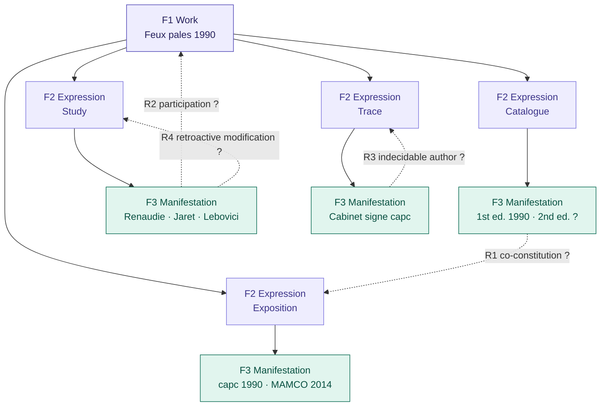

# Proposed mapping — F1_Work → F2_Expression → F3_Manifestation

## Diagram

## Rationale

The four F2_Expression groupings (Exposition, Catalogue, Study, Trace) reflect a modelling decision: *Feux pâles* exists under heterogeneous modes of existence that should not be flattened into a single expression. This grouping is defensible but not neutral.

## Ruptures

| Rupture | Description |
|---|---|
| **R1** | E2 (Catalogue) and E1 (Exposition) are co-constitutive, not independent sisters. FRBRoo has no property to express this relationship between two expressions of the same Work. |
| **R2** | E3 (Study) participates in the Work it documents. `R67_has_bibliographic_history` does not capture that a conservation study modifies the documentary object. |
| **R3** | The author of M4a (Cabinet d'amateur) is deliberately indecidable. `F28_Expression_Creation` requires an identifiable actor. |
| **R4** | M3a (Renaudie 2017) retroactively modifies the properties of the Expression it documents. No FRBRoo class supports this retroactive relationship. |
