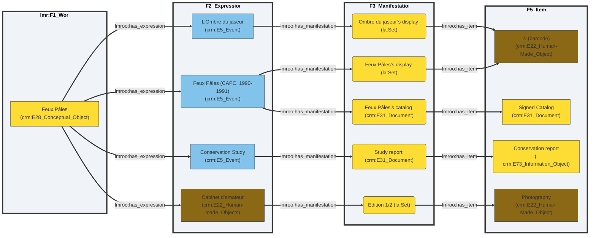
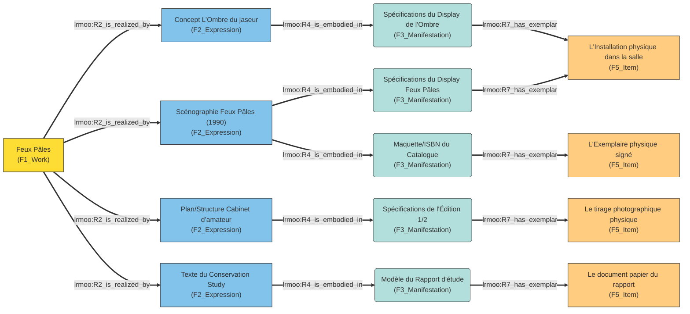
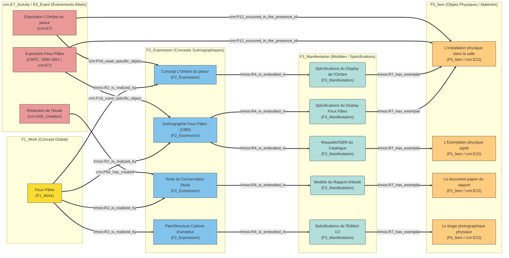
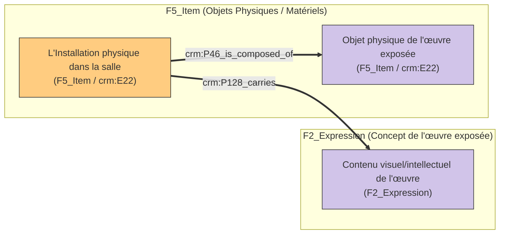

# Modelisation de l'activation

---

**English** · [Français](#français)

---

## English

---

## Français

## Objectif

Considérant les expositions comme issu des Mondes de l'art de Nelson Goodman (*Languages of Art*, 1968) je cherche à modéliser le fait que l'exposition Feux Pâles à plusieurs activations pour avoir un lien concrèt entre le premier accrochage et les activations ultérieures type interprétation (Mamco), Étude de conservation 2017, Un cabinet d'amateur, et pourquoi pas un souvenir...

L’objectif principal était de capturer les relations complexes entre :
- les **activités** (expositions, productions, créations),
- les **acteurs** (artistes, commissaires, archivistes),
- les **objets** (œuvres, documents, archives),
- les **concepts** (comme l’œuvre *Feux Pâles* elle-même, considérée comme une entité persistante),
tout en respectant les contraintes ontologiques du CIDOC CRM et en intégrant des extensions spécifiques.

## Hypothèses et question d'enquête

Comment représenter une *œuvre qui transcende ses manifestations physiques ?
Comment lier des itérations d’expositions entre elles (transformation, inspiration, réinterprétation) ?
Comment intégrer des sources archivistiques (catalogues, documents) comme éléments actifs de la documentation ?

## Réflexion

### CIDOC-CRM
#### 
L’exposition *Feux Pâles* (1990-1991) est à la fois :
- un événement (une activité temporelle, `E7_Activity`),
- un concept (une œuvre qui persiste dans la mémoire collective et les archives, au-delà de sa manifestation physique).

Le CIDOC CRM distingue clairement les **entités temporelles** (`E2_Temporal_Entity`, comme les événements) des **entités persistantes** (`E77_Persistent_Item`, comme les objets ou concepts). Or, *Feux Pâles* semble dépasser cette dichotomie. Elle existe via son activation par : sa documentation (via des catalogues, des archives), d’autres expositions (ex. *L’Ombre du jaseur*), tant qu’elle est mémorisée (par des acteurs, des documents, ou des œuvres dérivées).

Je choisis donc de représenter feux pâles sous deux formes : 

1. `E28_Conceptual_Object` pour *Feux Pâles* :
Cette classe permet de représenter des entités immatérielles (ex. une idée, un récit, une œuvre conceptuelle) qui existent sur plusieurs supports (documents, œuvres dérivées, et cidoc précise même la mémoire humaine !).
`E28` peut être lié à des activités via `P129_is_about` (pour dire qu’une exposition *traite* de ce concept) ou `P136_was_based_on` (pour dire qu’une exposition *s’inspire* de ce concept).

2. `E7_Activity` pour les expositions individuelles :
Chaque itération (*Feux Pâles* au CAPC, *L’Ombre du jaseur*) est modélisée comme une activité distincte, liée au concept *Feux Pâles* via `P129_is_about` ou `P136_was_based_on`.[^1]


3. Quid des autres activations ?

#### le lien d'interprétation
*L’Ombre du jaseur* est une "interprétation" de *Feux Pâles* d'après les termes de son curateur, Paul Bernard, mais :
- Elle n’est pas une transformation physique (qui relèverait de `E81_Transformation`, réservé aux `E18_Physical_Thing`),
- Elle n’est pas non plus une simple copie (qui relèverait de `E12_Production` avec un modèle).

Trois solutions sont envisagées :
1. `P136_was_based_on` (retenu) :
Cette propriété (issue de `E89_Propositional_Object`) permet de lier une activité à une source d’inspiration (ici, le concept *Feux Pâles*).

2. `E65_Creation` + `P136_was_based_on` :
Si *L’Ombre du jaseur* est considérée comme une **création** inspirée de *Feux Pâles*, on peut utiliser :
     ```turtle
     exhib:crea02 a crm:E65_Creation ;
         crm:P136_was_based_on exhib:exhib01 ;
         crm:P94_has_created exhib:exhib02 .
     ```
Qui permet de documenter le processus de création (qui, quand, comment). Mais `E65_Creation` est réservé aux œuvres conceptuelles (`E28`, `E89`), pas aux activités. 

3. `P16_used_specific_object` + archives :
Si *L’Ombre du jaseur* utilise des archives de *Feux Pâles* (ex. catalogues, documents), on peut lier les deux expositions via ces objets :
     ```turtle
     exhib:exhib02 crm:P16_used_specific_object exhib:trace0002 .
     exhib:trace0002 a crm:E78_Collection ;  # Archives du CAPC
         crm:P129i_is_subject_of exhib:exhib01 .  # Les archives traitent de exhib01
     ```
Mais ce n'est pas complètement compréhensible. Par contre il est tout à fait vrai que `P16_used_specific_object` à utiliser les archives du CAPC (`E78_Collection`), qui documentent *Feux Pâles*.

#### Accrochage

Les deux événements "expositions" ont des accrochages. Il y a dans cidoc, anciennement Collection : `E78_Curated_Holding` qui correspond à une collection d'objets physiques (ou conceptuels) assemblés et maintenus par un acteur (ex. un musée, un commissaire) pour un but spécifique (ex. une exposition, une archive).

- Propriétés clés :
  - `P46_is_composed_of` : Lie un `E78_Curated_Holding` à ses éléments constitutifs (ex. les œuvres exposées).
  - `P53_has_former_or_current_owner` : Lie le *Curated Holding* à son propriétaire (ex. le CAPC).
  - `P14_carried_out_by` : Lie le *Curated Holding* à l'acteur qui le gère (ex. le commissaire).

Pour Display, l'ontologiste David Valentine a préconisé de suivre linked Art et désigné l'accrochage comme un Set. Nous avions rejeté `E78 Curated Holding` car implique seulement des objets physiques. Or, une exposition peut être composée d’autres choses que des objets physiques. LinkedArt a introduit Set pour désigner tous les expôts ayant plusieurs set. A typé avec propriété thesaurus. Le mot Holding a une caractéristique très institutionnelle, de propriété donc de custody.

Faut-il une activité de creation ?

ex:curation_feux_pales a crm:E7_Activity ; # ou une creation ?
    rdfs:label "Sélection et commissariat des œuvres pour Feux pâles" ;
    crm:P14_carried_out_by ex:philippe_thomas ;
    crm:P14_carried_out_by ex:jean_louis_froment ;
    crm:P14_carried_out_by ex:sylvie_couderc ;
    crm:P14_carried_out_by ex:jean_marc_avrilla ;
    crm:P4_has_time-span "1990" ;
    crm:P3_has_note "Sélection de 96 biens culturels, impliquant 82 artistes/auteurs/artisans (dont 5 fictifs, 40 anonymes), couvrant la période 1520-1990" ;
    dcterms:source ex:rapport_conservation_1990 .

### Les autres types d'activations

Pour les oeuvres littéraires, FRBRoo avait introduit quatre niveaux de realisation à une oeuvre. Je propose d'utiliser LMRoo la derniere version pour déclarer tous les éléments de Feux Pâles.

### Question restante

Peut-on déclarer un catalogue en manifestation ET individuellement en Work afin de decliner de la même manière ? 

dans frbroo F15 Complex Work

This class comprises works that have other works as members. The members of a Complex Work may constitute alternatives to, derivatives of, or self-contained components of other members of the same Complex Work.

In practice, no clear line can be drawn between parallel and subsequent processes in the evolution of a work. One part may not be finished when another is already revised. An initially monolithic work may be taken up and evolve in pieces. The member relationship of Work is based on the conceptual relationship, and should not be confused with the internal structural parts of an individual expression. The fact that an expression may contain parts from other work(s) does not make the expressed work complex. For instance, an anthology for which only one version exists is not a complex work.

The boundaries of a Complex Work have nothing to do with the value of the intellectual achievement but only with the dominance of a concept. Thus, derivations such as translations are regarded as belonging to the same Complex Work, even though in addition they constitute an Individual Work themselves. In contrast, a Work that significantly takes up and merges concepts of other works so that it is no longer dominated by the initial concept is regarded as a new work. In cataloguing practice, detailed rules are established prescribing which kinds of derivation should be regarded as crossing the boundaries of a complex work. Adaptation and derivation graphs allow the recognition of distinct sub-units, i.e. a complex work contained in a larger complex work.

As a Complex Work can be taken up by any creator who acquires the spirit of its concept, it is never finished in an absolute sense.

Ņ'est plus dans LMROO

When the library community consolidated its standards into the IFLA Library Reference Model (IFLA LRM), it prioritized a higher-level, more compact hierarchy. The deprecation of F15 Complex Work comes down to three main architectural reasons:1. Radical Simplification of the HierarchyFRBRoo was frequently criticized for being too long and overly granular, containing 48 classes and 72 properties. LRMoo slashed this down to just 18 classes. To achieve this, the working group deprecated specialized subclasses of F1 Work (such as F14 Individual Work, F15 Complex Work, F16 Container Work, and F17 Aggregation Work).2. Redundancy and Inherited AttributesIn FRBRoo, a "Complex Work" was defined as a work that brings together other member works (like a series of novels, a multi-volume encyclopedia, or a work and its various adaptations).However, the semantic features, relationships, and properties of F15 Complex Work were essentially identical to its parent class, F1 Work. Because a general F1 Work is already fully capable of being realized in multiple expressions or having relationships with other works, maintaining a specific "Complex" subclass was structurally redundant.3. The Shift to General RelationshipsThe removal of the class does not mean LRMoo lost the ability to express complex relationships. Instead of sorting works into strict "individual" or "complex" pigeonholes at the class level, LRMoo handles complexity dynamically through properties.How to model it now: You simply use the base class F1 Work.If a work contains, adapts, or references another work, you express that "complexity" using general CIDOC CRM / LRMoo structural properties (such as R67 has part, R75 incorporates, or R20 text derivative of).


Tentativs : 

<figure>


<figcaption>{'@prefix crm: <http://www.cidoc-crm.org/cidoc-crm/>'}</figcaption>
<figcaption>{'@prefix la: <https://linked.art/ns/terms/>'}</figcaption>
<figcaption>{'@prefix la: <http://iflastandards.info/ns/lrm/lrmoo/>'}</figcaption>
</figure>








la réparatition entre ce qui serait une expression, manifestation, item est discutable. Pour moi le catalogue serait soit une expression soit une manifestation. Dans les définitions de FRBR les items étaient plutôt destinés aux exemplaires bibliographiques qui pouvaient porter des marques de propriétaires, des annotations, etc. Je n’ai pas en tête la définition donnée par LRM. Mais ce dispositif était initialement pour les œuvres multiples et tu pourrais en avoir beosin pour les catalogues justement.

## Choix actuel
```turtle
@prefix crm: <http://www.cidoc-crm.org/cidoc-crm/> .
@prefix la: <https://linked.art/ns/terms/> .
@prefix lrmoo: <http://iflastandards.info/ns/lrm/lrmoo/> .
@prefix rdfs: <http://www.w3.org/2000/01/rdf-schema#> .
@prefix rdf: <http://www.w3.org/1999/02/22-rdf-syntax-ns#> .

# --- F1: Work (Conceptual Object) ---
:Feux_Pales_Work rdf:type crm:E28_Conceptual_Object ;
    rdfs:label "Feux Pâles" .

# --- F2: Expressions ---
:Feux_Pales_Expression_CAPC rdf:type crm:E5_Event ;
    rdfs:label "Feux Pâles (CAPC, 1990-1991)" ;
    lrmoo:has_expression :Feux_Pales_Work .

:Ombre_du_jaseur_Expression rdf:type crm:E5_Event ;
    rdfs:label "L'Ombre du jaseur" ;
    lrmoo:has_expression :Feux_Pales_Work .

:Cabinet_d_amateur_Expression rdf:type crm:E22_Human_Made_Object ;
    rdfs:label "Cabinet d'amateur" ;
    lrmoo:has_expression :Feux_Pales_Work .

:Conservation_Study_Expression rdf:type crm:E5_Event ;
    rdfs:label "Conservation Study" ;
    lrmoo:has_expression :Feux_Pales_Work .

# --- F3: Manifestations ---
:Feux_Pales_Display_Manifest rdf:type crm:E76_Collection ; # Supposé E76 pour "la:Set" si pas défini, ou E22
    rdfs:label "Feux Pâles's display" ;
    lrmoo:has_manifestation :Feux_Pales_Expression_CAPC .

:Feux_Pales_Catalog_Manifest rdf:type crm:E31_Document ;
    rdfs:label "Feux Pâles's catalog" ;
    lrmoo:has_manifestation :Feux_Pales_Expression_CAPC .

:Ombre_du_jaseur_Display_Manifest rdf:type crm:E76_Collection ;
    rdfs:label "Ombre du jaseur's display" ;
    lrmoo:has_manifestation :Ombre_du_jaseur_Expression .

:Study_Report_Manifest rdf:type crm:E31_Document ;
    rdfs:label "Study report" ;
    lrmoo:has_manifestation :Conservation_Study_Expression .

:Edition_1_2_Manifest rdf:type crm:E22_Human_Made_Object ;
    rdfs:label "Edition 1/2" ;
    lrmoo:has_manifestation :Cabinet_d_amateur_Expression .

# --- F5: Items ---
:Item_Barcode rdf:type crm:E22_Human_Made_Object ;
    rdfs:label "® (barcode)" ;
    lrmoo:has_item :Feux_Pales_Display_Manifest ;
    lrmoo:has_item :Ombre_du_jaseur_Display_Manifest .

:Item_Catalog rdf:type crm:E31_Document ;
    rdfs:label "Catalogue" ;
    lrmoo:has_item :Feux_Pales_Catalog_Manifest .

:Item_Report rdf:type crm:E73_Information_Object ;
    rdfs:label "Conservation report" ;
    lrmoo:has_item :Study_Report_Manifest .

:Item_Display rdf:type crm:E22_Human_Made_Object ;
    rdfs:label "Display" ;
    lrmoo:has_item :Edition_1_2_Manifest .

[^1]: Dans [Display](#REFlien), les expositions sont traitées comme des événements, des activités qui ont le type AAT Activité d’exposition. Toujours le patron utilisé par LinkedArt. `E7 type` avec AAT le terme « activité d’exposition »