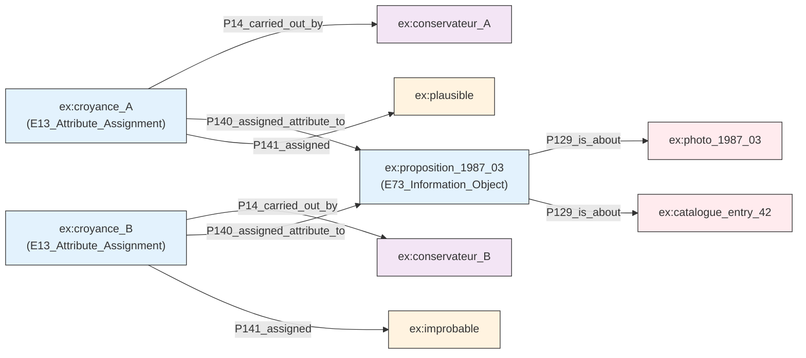
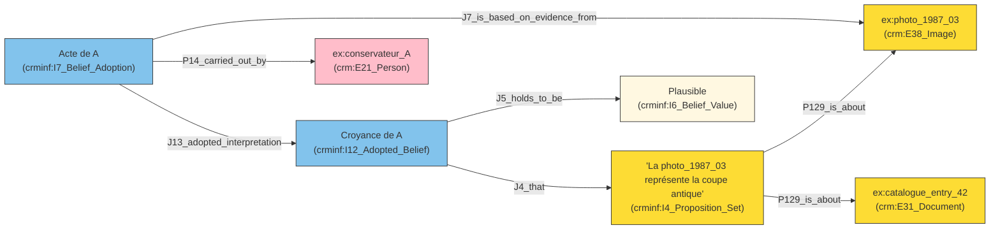

## **Article 1 : Modéliser l’incertitude qualitative dans les bases de connaissances muséales**
*Comment documenter le "peut-être" sans créer d’incohérence ?*

---
**English** · [Français](#français)

---

## English

---

## **Français**

---

### **Objectif**

Dans le cadre du projet *Feux pâles* de **Philippe Thomas**, les conservateurs j'ai été souvent confronté à des **identifications incertaines**. Par exemple, une photographie d’exposition montre une œuvre qui *ressemble* à une entrée du catalogue, mais sans certitude absolue. Le **CIDOC CRM** ne permet pas de capturer cette nuance, ce qui pose problème pour :
- **Préserver les interprétations** des chercheurs (ex. : "Le conservateur A pense que cette coupe correspond à l’entrée *Coupe antique*, mais de manière plausible").
- **Éviter les incohérences** si un autre conservateur (B) juge cette identification *improbable*.
- **Rendre interrogeables** ces degrés de certitude (ex. : "Quelles informations sont jugées *plausibles* par le conservateur A ?").

L’objectif est de **documenter ces incertitudes** comme des données à part entière, en s’inspirant des principes de **transparence épistémique** : l’incertitude n’est pas un défaut, mais une **information légitime**.

### **Hypothèses et questions d’enquête**

**Hypothèses** :
1. **L’incertitude comme donnée positive** :
   Une croyance incertaine (ex. : "plausible") est une **interprétation documentée**, pas une absence de connaissance. Le CRM actuel ne permet pas de la modéliser, ce qui appauvrit la représentation des états de connaissance.
2. **La contradiction comme richesse** :
   Plusieurs chercheurs peuvent avoir des avis contradictoires sur le même fait (ex. : "Le conservateur A pense que l’identification est plausible, le conservateur B la juge improbable"). Ces contradictions doivent **enrichir** le graphe, pas le rendre incohérent.

**Questions clés** :
- Comment modéliser une proposition incertaine comme *"La photo X représente peut-être l’œuvre Y"* ?
- Comment distinguer les degrés de certitude (*plausible*, *probable*, *certain*) de manière interrogeable ?
- Comment permettre à plusieurs chercheurs d’avoir des avis contradictoires **sans conflit** ?

### **Déroulé de la réflexion**

#### **1. Exemple concret : L’identification incertaine dans *Feux pâles***

Dans le cadre de *Feux pâles*, une **photographie d’exposition** (ex. : `ex:photo_1987_03`) montre une œuvre qui ressemble à l’entrée *"Coupe antique"* (`ex:catalogue_entry_42`) du catalogue. Cependant :
- Le **conservateur A** estime que cette identification est **plausible** (basé sur des similitudes stylistiques).
- Le **conservateur B** la juge **improbable** (basé sur des différences de matériaux).
- Aucun des deux n’a de **preuve définitive**.

Avec le CRM standard, on ne peut pas modéliser ces **nuances** sans créer de conflit (ex. : une même œuvre ne peut pas être à la fois "plausiblement" et "improbablement" identifiée).

#### **2. Première piste : Utiliser des valeurs qualitatives dans le CRM de base**

Ajouter une propriété qualitative (ex. : `"plausible"`) directement à la relation entre `ex:photo_1987_03` et `ex:catalogue_entry_42`.

**Problèmes** :
- **Ambiguïté** : Impossible de savoir *qui* a émis cette croyance (A ou B ?).
- **Conflit** : Si A et B ont des avis opposés, le graphe devient incohérent.
- **Non interrogeable** : On ne peut pas demander *"Quelles œuvres sont jugées plausibles par A ?"*.

**Conclusion** :
Cette approche ne permet pas de **distinguier les acteurs** ni de **gérer les contradictions**.

#### **3. Deuxième piste : La réification avec le CRM de base**

Transformer la proposition *"La photo X représente l’œuvre Y"* en un **objet** (`E73_Information_Object`), puis y attacher une **attribution qualitative** (`E13_Attribute_Assignment`).

**Modélisation pour *Feux pâles*** :
```turtle
# Proposition : "La photo_1987_03 représente la coupe antique (catalogue_entry_42)"
ex:proposition_1987_03 a crm:E73_Information_Object ;
    rdfs:label "La photo_1987_03 représente la coupe antique (catalogue_entry_42)" ;
    crm:P129_is_about ex:photo_1987_03, ex:catalogue_entry_42 .

# Croyance du conservateur A : "plausible"
ex:croyance_A a crm:E13_Attribute_Assignment ;
    crm:P140_assigned_attribute_to ex:proposition_1987_03 ;
    crm:P141_assigned "plausible" ;
    crm:P14_carried_out_by ex:conservateur_A .

# Croyance du conservateur B : "improbable"
ex:croyance_B a crm:E13_Attribute_Assignment ;
    crm:P140_assigned_attribute_to ex:proposition_1987_03 ;
    crm:P141_assigned "improbable" ;
    crm:P14_carried_out_by ex:conservateur_B .
```

**Avantages** :
- **Distinction des acteurs** : On sait qui a émis chaque croyance.
- **Pas de conflit** : Les deux croyances coexistent.

**Limites** :
- **Peu expressif** : On ne peut pas lier la croyance à une **preuve** (ex. : la photo).
- **Difficile à interroger** : Les requêtes pour filtrer par degré de certitude sont complexes.

**Schéma Mermaid** :



#### **4. Troisième piste : Utiliser CRMinf pour une modélisation sémantique**

Utiliser **CRMinf** pour modéliser :
- **`I4_Proposition_Set`** : La proposition *"La photo_1987_03 représente la coupe antique"*.
- **`I12_Adopted_Belief`** : La croyance du conservateur A (*"plausible"*).
- **`I6_Belief_Value`** : La valeur de vérité (*"Plausible"*).
- **`I7_Belief_Adoption`** : L’acte d’adoption de la croyance, **basé sur la photo** (`J7_is_based_on_evidence_from`).

**Modélisation pour *Feux pâles*** :
```turtle
# Proposition
ex:prop_1987_03 a crminf:I4_Proposition_Set ;
    rdfs:label "La photo_1987_03 représente la coupe antique (catalogue_entry_42)" ;
    crm:P129_is_about ex:photo_1987_03, ex:catalogue_entry_42 .

# Valeur de vérité : "Plausible"
ex:plausible_value a crminf:I6_Belief_Value ;
    rdfs:label "Plausible" .

# Croyance du conservateur A
ex:belief_A a crminf:I12_Adopted_Belief ;
    crminf:J4_that ex:prop_1987_03 ;
    crminf:J5_holds_to_be ex:plausible_value .

# Acte d'adoption (basé sur la photo)
ex:act_A a crminf:I7_Belief_Adoption ;
    crminf:J13_adopted_interpretation ex:belief_A ;
    crm:P14_carried_out_by ex:conservateur_A ;
    crminf:J7_is_based_on_evidence_from ex:photo_1987_03 .
```

**Avantages** :
- **Expressivité riche** : On distingue la proposition, la croyance, et sa valeur de vérité.
- **Preuves associées** : La croyance est liée à la photo (`J7_is_based_on_evidence_from`).
- **Interrogeable** : On peut demander *"Quelles propositions sont jugées plausibles par A ?"*.

**Schéma Mermaid** :



#### **5. Alignement avec les travaux du SIG CIDOC-CRM**
Le **SIG CIDOC-CRM** a travaillé sur :
- **CRMinf** pour modéliser les croyances et leurs degrés de vérité.
- **Les *negative typed properties*** pour les lacunes.

Notre approche s’aligne sur ces travaux en utilisant **CRMinf** pour modéliser les **incertitudes**.

### **Choix final**

**Solution retenue : CRMinf**
Pour modéliser l’incertitude dans *Feux pâles*, nous utilisons :
1. **`I4_Proposition_Set`** : Pour la proposition *"La photo_1987_03 représente la coupe antique"*.
2. **`I12_Adopted_Belief`** : Pour la croyance du conservateur A (*"plausible"*).
3. **`I6_Belief_Value`** : Pour la valeur de vérité (*"Plausible"*).
4. **`I7_Belief_Adoption`** : Pour l’acte d’adoption, **basé sur la photo**.

**Exemple de requête SPARQL** :
```sparql
# Trouver toutes les œuvres jugées "plausibles" par le conservateur A
SELECT ?oeuvre WHERE {
  ?proposition a crminf:I4_Proposition_Set ;
               crm:P129_is_about ?oeuvre .
  ?belief a crminf:I12_Adopted_Belief ;
           crminf:J4_that ?proposition ;
           crminf:J5_holds_to_be ?valeur .
  ?valeur a crminf:I6_Belief_Value ;
          rdfs:label "Plausible" .
  ?act a crminf:I7_Belief_Adoption ;
       crminf:J13_adopted_interpretation ?belief ;
       crm:P14_carried_out_by ex:conservateur_A .
}
```
