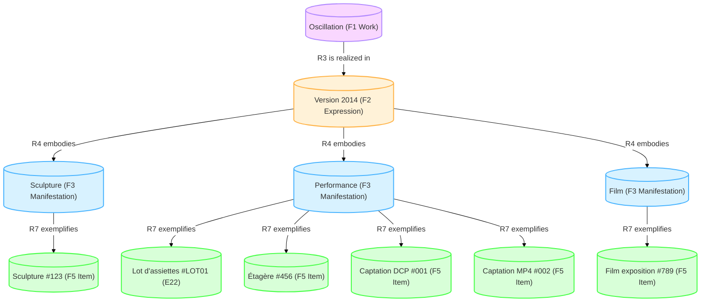
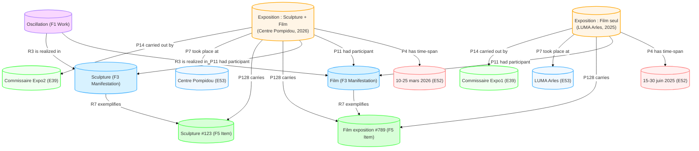
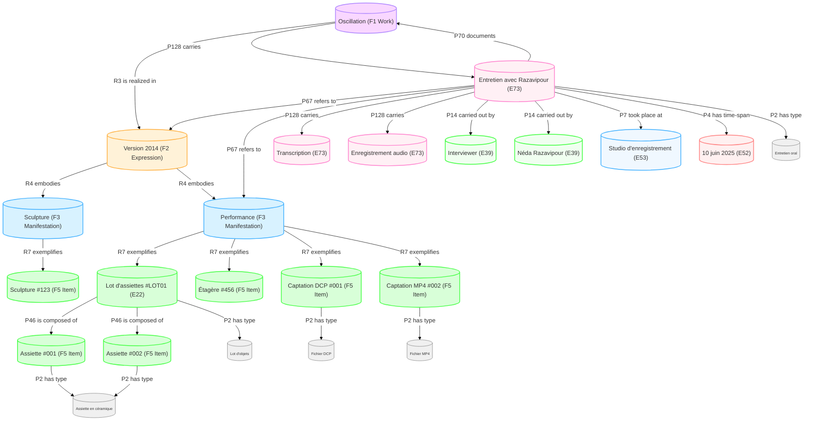

| Classe             | Couleur de remplissage | Couleur de bordure | Description                                                  |
| ------------------ | ---------------------- | ------------------ | ------------------------------------------------------------ |
| Work (F1)          | #f9d7ff (lilas)        | #b189ff (violet)   | Représente l'œuvre conceptuelle (ex: "Oscillation"). C'est l'idée abstraite de l'œuvre. |
| Expression (F2)    | #fff2d8 (jaune pâle)   | #ffb347 (orange)   | Représente une version spécifique de l'œuvre (ex: "Version 2014"). |
| Manifestation (F3) | #d8f2ff (bleu pâle)    | #47b3ff (bleu)     | Représente une forme concrète de l'expression (ex: sculpture, performance, film). |
| Item (F5)          | #d8ffd8 (vert pâle)    | #47ff47 (vert)     | Représente un exemplaire physique ou numérique (ex: "Sculpture #123", "Captation MP4"). |

```mermaid
%%{init: {'theme': 'base', 'themeVariables': { 'primaryColor': '#ffd3e0', 'edgeLabelBackground':'#fff'}}}%%
graph TD
    %% ========== STYLE ==========
    classDef work fill:#f9d7ff,stroke:#b189ff,stroke-width:2px;
    classDef expression fill:#fff2d8,stroke:#ffb347,stroke-width:2px;
    classDef manifestation fill:#d8f2ff,stroke:#47b3ff,stroke-width:2px;
    classDef item fill:#d8ffd8,stroke:#47ff47,stroke-width:2px;
    classDef info fill:#fff0f5,stroke:#ff85cf,stroke-width:2px;
    classDef actor fill:#f0fff0,stroke:#47ff47,stroke-width:2px;
    classDef place fill:#f0f8ff,stroke:#47b3ff,stroke-width:2px;
    classDef time fill:#fff0f0,stroke:#ff8585,stroke-width:2px;
    classDef event fill:#fff5e6,stroke:#ffa500,stroke-width:2px;

    %% ========== ŒUVRE (LMRoo) ==========
    F1[("Oscillation (F1 Work)")]:::work
    F2[("Version 2014 (F2 Expression)")]:::expression
    F3S[("Sculpture (F3 Manifestation)")]:::manifestation
    F3P[("Performance (F3 Manifestation)")]:::manifestation
    F3F[("Film (F3 Manifestation)")]:::manifestation

    %% ========== ITEMS ==========
    F5S[("Sculpture #123 (F5 Item)")]:::item
    F5Film[("Film exposition #789 (F5 Item)")]:::item
    F5E[("Étagère #456 (F5 Item)")]:::item

    %% ========== EXPOSITION (E7 Activity) ==========
    E7Expo[("Exposition : Sculpture + Film\n(Centre Pompidou, 2026)")]:::event

    %% ========== DOCUMENTATION D'EXPOSITION (E73) ==========
    %% Documents produits pendant l'exposition
    E73CE[("Constat d'état\n(avant exposition)")]:::info
    E73RI[("Rapport d'installation")]:::info
    E73PD[("Photos déballage/remballage")]:::info
    E73PV[("Photos/vidéos de l'exposition")]:::info
    E73M[("Document de médiation")]:::info
    E73PSBC[("PSBC : Plan de Sécurité")]:::info
    E73Budget[("Budget de l'exposition")]:::info
    E73Contrat[("Contrat de prêt")]:::info
    E73Maintenance[("Rapport de maintenance")]:::info

    %% ========== ACTEURS (E39) ==========
    E39C[("Commissaire (E39)")]:::actor
    E39R[("Régisseur (E39)")]:::actor
    E39T[("Technicien (E39)")]:::actor
    E39M[("Médiateur (E39)")]:::actor
    E39S[("Service de sécurité (E39)")]:::actor

    %% ========== LIEUX (E53) ==========
    E53Pomp[("Centre Pompidou (E53)")]:::place
    E53Atelier[("Atelier de préparation (E53)")]:::place
    E53Stock[("Stockage (E53)")]:::place

    %% ========== TEMPS (E52) ==========
    E52Expo[("10-25 mars 2026 (E52)")]:::time
    E52Prep[("1-5 mars 2026 (E52)")]:::time
    E52Demont[("26-30 mars 2026 (E52)")]:::time

    %% ========== RELATIONS LMRoo ==========
    F1 -->|"R3 is realized in"| F2
    F2 -->|"R4 embodies"| F3S
    F2 -->|"R4 embodies"| F3P
    F2 -->|"R4 embodies"| F3F
    F3S -->|"R7 exemplifies"| F5S
    F3F -->|"R7 exemplifies"| F5Film
    F3P -->|"R7 exemplifies"| F5E

    %% ========== RELATIONS EXPOSITION ==========
    E7Expo -->|"P14 carried out by"| E39C
    E7Expo -->|"P7 took place at"| E53Pomp
    E7Expo -->|"P4 has time-span"| E52Expo
    E7Expo -->|"P128 carries"| F5S
    E7Expo -->|"P128 carries"| F5Film
    E7Expo -->|"P11 had participant"| F3S
    E7Expo -->|"P11 had participant"| F3F

    %% ========== DOCUMENTATION LIÉE À L'EXPOSITION ==========
    %% Documents produits avant/pendant/après l'exposition
    E7Expo -->|"P128 carries"| E73CE
    E7Expo -->|"P128 carries"| E73RI
    E7Expo -->|"P128 carries"| E73PD
    E7Expo -->|"P128 carries"| E73PV
    E7Expo -->|"P128 carries"| E73M
    E7Expo -->|"P128 carries"| E73PSBC
    E7Expo -->|"P128 carries"| E73Budget
    E7Expo -->|"P128 carries"| E73Contrat
    E7Expo -->|"P128 carries"| E73Maintenance

    %% ========== LIENS ENTRE DOCUMENTS ET ITEMS ==========
    E73CE -->|"P67 refers to"| F5S
    E73CE -->|"P67 refers to"| F5Film
    E73CE -->|"P67 refers to"| F5E

    E73RI -->|"P67 refers to"| F5S
    E73RI -->|"P67 refers to"| F5E

    E73PD -->|"P67 refers to"| F5S
    E73PD -->|"P67 refers to"| F5Film
    E73PD -->|"P67 refers to"| F5E

    E73PV -->|"P67 refers to"| F5S
    E73PV -->|"P67 refers to"| F5Film

    E73M -->|"P67 refers to"| F1
    E73M -->|"P67 refers to"| F3S
    E73M -->|"P67 refers to"| F3P

    E73PSBC -->|"P67 refers to"| F5S
    E73PSBC -->|"P67 refers to"| F5Film

    E73Contrat -->|"P67 refers to"| F5S
    E73Contrat -->|"P67 refers to"| F5Film

    E73Maintenance -->|"P67 refers to"| F5Film

    %% ========== ACTEURS LIÉS À LA DOCUMENTATION ==========
    E73CE -->|"P14 carried out by"| E39R
    E73RI -->|"P14 carried out by"| E39T
    E73PD -->|"P14 carried out by"| E39T
    E73PV -->|"P14 carried out by"| E39T
    E73M -->|"P14 carried out by"| E39M
    E73PSBC -->|"P14 carried out by"| E39S
    E73Budget -->|"P14 carried out by"| E39C
    E73Contrat -->|"P14 carried out by"| E39C
    E73Maintenance -->|"P14 carried out by"| E39T

    %% ========== LIEUX LIÉS À LA DOCUMENTATION ==========
    E73CE -->|"P7 took place at"| E53Atelier
    E73RI -->|"P7 took place at"| E53Pomp
    E73PD -->|"P7 took place at"| E53Pomp
    E73PV -->|"P7 took place at"| E53Pomp
    E73Maintenance -->|"P7 took place at"| E53Pomp

    %% ========== TEMPS LIÉS À LA DOCUMENTATION ==========
    E73CE -->|"P4 has time-span"| E52Prep
    E73RI -->|"P4 has time-span"| E52Prep
    E73PD -->|"P4 has time-span"| E52Prep
    E73PV -->|"P4 has time-span"| E52Expo
    E73Maintenance -->|"P4 has time-span"| E52Expo
    E73Demont[("Photos démontage")]:::info
    E73Demont -->|"P4 has time-span"| E52Demont
    E73Demont -->|"P67 refers to"| F5S
    E73Demont -->|"P67 refers to"| F5Film
    E7Expo -->|"P128 carries"| E73Demont
```

