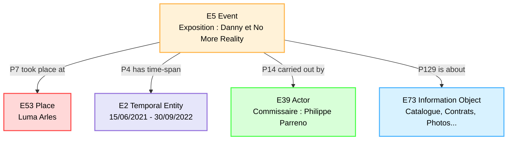
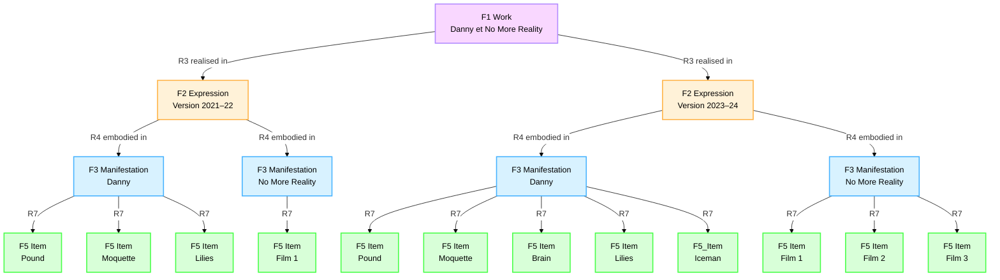

```mermaid
graph TD
    E5["E5 Event\nExposition : Danny et No More Reality"]:::E5
    E53["E53 Place\nLuma Arles"]:::E53
    E2["E2 Temporal Entity\n15/06/2021 - 30/09/2022"]:::E2
    E39["E39 Actor\nCommissaire : Philippe Parreno"]:::E39
    E73["E73 Information Object\nCatalogue, Contrats, Photos..."]:::E73

E5 -->|"P7 took place at"| E53
E5 -->|"P4 has time-span"| E2
E5 -->|"P14 carried out by"| E39
E5 -->|"P129 is about"| E73

classDef E5 fill:#fff2d8,stroke:#ffb347,stroke-width:2px,color:#000;
classDef E53 fill:#ffd8d8,stroke:#ff4747,stroke-width:2px,color:#000;
classDef E2 fill:#e6e6fa,stroke:#9370db,stroke-width:2px,color:#000;
classDef E39 fill:#d8ffd8,stroke:#47ff47,stroke-width:2px,color:#000;
classDef E73 fill:#d8f2ff,stroke:#47b3ff,stroke-width:2px,color:#000;
```

```mermaid
%%{init: {'theme': 'base', 'themeVariables': {
    'primaryColor': '#ffd3e0',
    'edgeLabelBackground':'#fff'
}}}%%
graph TD
    %% Styles pour les classes
    classDef work fill:#f9d7ff,stroke:#b189ff,stroke-width:2px,color:#000;
    classDef expression fill:#fff2d8,stroke:#ffb347,stroke-width:2px,color:#000;
    classDef manifestation fill:#d8f2ff,stroke:#47b3ff,stroke-width:2px,color:#000;
    classDef item fill:#d8ffd8,stroke:#47ff47,stroke-width:2px,color:#000;
%% Niveau F1 : Work
F1["F1 Work\nDanny et No More Reality"]:::work

%% Niveau F2 : Expressions
F2_2021_22["F2 Expression\nVersion 2021–22"]:::expression
F2_2023_24["F2 Expression\nVersion 2023–24"]:::expression

%% Niveau F3 : Manifestations
F3_Danny_2021["F3 Manifestation\nDanny"]:::manifestation
F3_NoMoreReality_2021["F3 Manifestation\nNo More Reality"]:::manifestation
F3_Danny_2023["F3 Manifestation\nDanny"]:::manifestation
F3_NoMoreReality_2023["F3 Manifestation\nNo More Reality"]:::manifestation

%% Niveau F5 : Items
%% Pour F3_Danny_2021
F5_Pound_2021["F5 Item\nPound"]:::item
F5_Moquette_2021["F5 Item\nMoquette"]:::item
F5_Lilies_2021["F5 Item\nLilies"]:::item

%% Pour F3_NoMoreReality_2021
F5_Film1_2021_NMR["F5 Item\nFilm 1"]:::item

%% Pour F3_Danny_2023
F5_Pound_2023["F5 Item\nPound"]:::item
F5_Moquette_2023["F5 Item\nMoquette"]:::item
F5_Brain_2023["F5 Item\nBrain"]:::item
F5_Lilies_2023["F5 Item\nLilies"]:::item
F5_Iceman_2023["F5_Item\nIceman"]:::item

%% Pour F3_NoMoreReality_2023
F5_Film1_2023_NMR["F5 Item\nFilm 1"]:::item
F5_Film2_2023_NMR["F5 Item\nFilm 2"]:::item
F5_Film3_2023_NMR["F5 Item\nFilm 3"]:::item

%% Relations
F1 -->|"R3 realised in"| F2_2021_22
F1 -->|"R3 realised in"| F2_2023_24

F2_2021_22 -->|"R4 embodied in"| F3_Danny_2021
F2_2021_22 -->|"R4 embodied in"| F3_NoMoreReality_2021

F2_2023_24 -->|"R4 embodied in"| F3_Danny_2023
F2_2023_24 -->|"R4 embodied in"| F3_NoMoreReality_2023

F3_Danny_2021 -->|"R7"| F5_Pound_2021
F3_Danny_2021 -->|"R7"| F5_Moquette_2021
F3_Danny_2021 -->|"R7"| F5_Lilies_2021


F3_NoMoreReality_2021 -->|"R7"| F5_Film1_2021_NMR

F3_Danny_2023 -->|"R7"| F5_Pound_2023
F3_Danny_2023 -->|"R7"| F5_Moquette_2023
F3_Danny_2023 -->|"R7"| F5_Brain_2023
F3_Danny_2023 -->|"R7"| F5_Lilies_2023
F3_Danny_2023 -->|"R7"| F5_Iceman_2023


F3_NoMoreReality_2023 -->|"R7"| F5_Film1_2023_NMR
F3_NoMoreReality_2023 -->|"R7"| F5_Film2_2023_NMR
F3_NoMoreReality_2023 -->|"R7"| F5_Film3_2023_NMR
```